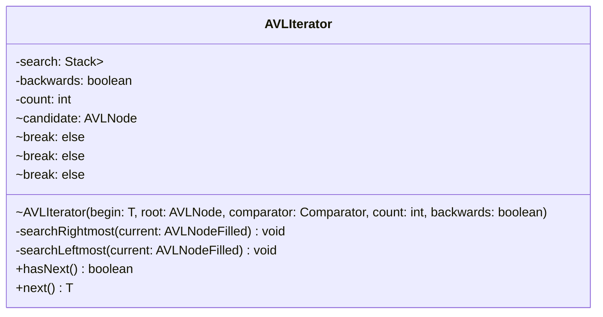

# AVLIterator.java

## Explanation

This file defines the AVLIterator class in the sorteddata.avltree package. It belongs to src/sorteddata/avltree in the COMP2100 MiniLab codebase and implements AVL tree behavior for balanced sorted data operations. Key methods include searchRightmost, searchLeftmost, hasNext, next.

## Complexity

Typical AVL tree operations such as search, insertion, and deletion are O(log n), assuming the tree remains height-balanced.

## UML



## Code
```java
package sorteddata.avltree;

import java.util.Arrays;
import java.util.Comparator;
import java.util.Iterator;
import java.util.Stack;

public class AVLIterator<T> implements Iterator<T> {
    private final Stack<AVLNodeFilled<T>> search;
    private final boolean backwards;

    private int count;

    AVLIterator(T begin, AVLNode<T> root, Comparator<T> comparator, int count, boolean backwards) {
        this.search = new Stack<>();
        this.count = count;
        this.backwards = backwards;

        if (!(root instanceof AVLNodeFilled<T> current)) return;

        while (true) {
            AVLNode<T> candidate = null;
            if ((begin == null && !backwards) || (begin != null && comparator.compare(current.value, begin) > 0)) {
                if (!backwards) search.push(current);
                candidate = current.left;
            } else if (begin != null && comparator.compare(current.value, begin) == 0)
                search.push(current);
            else {
                if (backwards) search.push(current);
                candidate = current.right;
            }

            if (candidate instanceof AVLNodeFilled<T> filled)
                current = filled;
            else break;
        }
    }

    private void searchRightmost(AVLNodeFilled<T> current) {
        while (true) {
            this.search.push(current);
            if (current.right instanceof AVLNodeFilled<T> filled) current = filled;
            else break;
        }
    }

    private void searchLeftmost(AVLNodeFilled<T> current) {
        while (true) {
            this.search.push(current);
            if (current.left instanceof AVLNodeFilled<T> filled) current = filled;
            else break;
        }
    }

    @Override
    public boolean hasNext() {
        if (search.isEmpty())
            return false;
        if (count == 0)
            return false;
        return true;
    }

    @Override
    public T next() {
        if (count > 0) count--;
        AVLNodeFilled<T> result = search.pop();
        if (!backwards) {
            if (result.right instanceof AVLNodeFilled<T> right) {
                searchLeftmost(right);
            }
        } else {
            if (result.left instanceof AVLNodeFilled<T> left) {
                searchRightmost(left);
            }
        }
        return result.value;
    }
}

```
