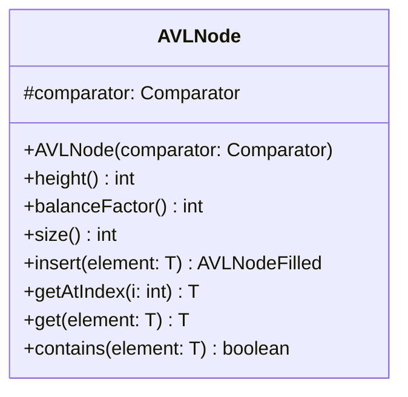

# AVLNode.java

## Explanation

This file defines the AVLNode class in the sorteddata.avltree package. It belongs to src/sorteddata/avltree in the COMP2100 MiniLab codebase and implements AVL tree behavior for balanced sorted data operations. Key methods include height, balanceFactor, size, insert, getAtIndex.

## Complexity

Typical AVL tree operations such as search, insertion, and deletion are O(log n), assuming the tree remains height-balanced.

## UML



## Code
```java
package sorteddata.avltree;

import java.util.Comparator;

/**
 * Implementation of a node in an AVL (Adelson-Velsky & Landis) Tree, which is
 * a type of self-balancing binary search tree that provides substantial
 * benefits over straight binary search trees.
 * @param <T>
 */
abstract class AVLNode<T> {
	protected final Comparator<T> comparator;

	/**
	 * Creates an AVL tree based on the specified comparator,
	 * which dictates the sorting order
	 * @param comparator the comparator to use for sorting
	 */
	public AVLNode(Comparator<T> comparator) {
		this.comparator = comparator;
	}

	/**
	 * Computes the height of the tree, where empty nodes
	 * have zero height, leaves have one height, nodes whose
	 * children are leaves have two height, and so on.
	 * @return the height of the tree
	 */
	public abstract int height();

	/**
	 * Computes the balance factor of the three, which is the
	 * difference in height between the left and right subtrees
	 * @return the balance factor
	 */
	public abstract int balanceFactor();

	/**
	 * Computes the size of the tree, which is the number of
	 * nodes stored. This is essentially the equivalent of
	 * .length for an array
	 * @return
	 */
	public abstract int size();

	/**
	 * Adds a particular element to the tree. Duplicates are ignored
	 * (that is, they will not be added), and other elements are properly
	 * added as a leaf in a position specified by the tree's comparator.
	 * Because this implementation is immutable, the current tree is not modified.
	 * @param element the element to add
	 * @return the resulting tree
	 */
	public abstract AVLNodeFilled<T> insert(T element);

	/**
	 * Fetches the element at a particular ordered index, where the leftmost
	 * element is index zero. This is equivalent to [] notation for an array.
	 * @param i the index to get
	 * @return the element if i is within bounds, null otherwise
	 */
	public abstract T getAtIndex(int i);

	/**
	 * Searches for matches for a particular element, according to the comparator
	 * @param element the element to search for
	 * @return the element if found, null otherwise
	 */
	public abstract T get(T element);

	/**
	 * Searches for matches for a particular element, according to the comparator
	 * @param element the element to search for
	 * @return true if the element exists in the tree, false otherwise
	 */
	public abstract boolean contains(T element);
}

```
