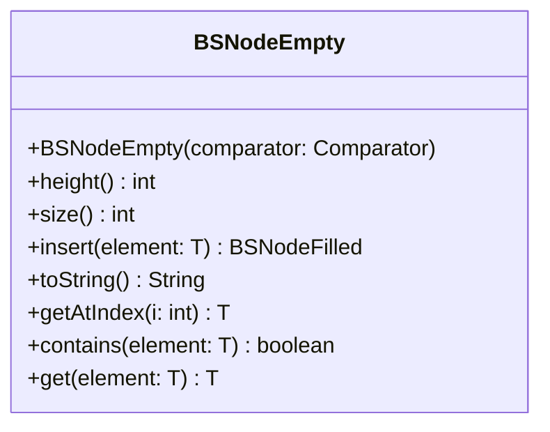

# BSNodeEmpty.java

## Explanation

This file defines the BSNodeEmpty class in the sorteddata.bstree package. It belongs to src/sorteddata/bstree in the COMP2100 MiniLab codebase and implements binary search tree behavior for sorted data operations. Key methods include height, size, insert, toString, getAtIndex.

## Complexity

Typical binary search tree operations are O(h), where h is tree height. In a balanced tree this is O(log n), but in the worst case it may be O(n).

## UML



## Code
```java
package sorteddata.bstree;


import java.util.Comparator;

class BSNodeEmpty<T> extends BSNode<T> {
	public BSNodeEmpty(Comparator<T> comparator) {
		super(comparator);
	}

	public int height() {
		return 0;
	}

	public int size() {
		return 0;
	}

	public BSNodeFilled<T> insert(T element) {
		return new BSNodeFilled<>(comparator, element, this, this);
	}

	public String toString() {
		return ".";
	}

	public T getAtIndex(int i) {
		return null;
	}

	public boolean contains(T element) {
		return false;
	}

	public T get(T element) {
		return null;
	}
}

```
