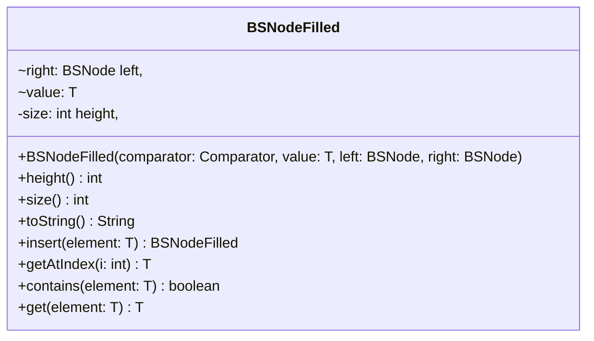

# BSNodeFilled.java

## Explanation

This file defines the BSNodeFilled class in the sorteddata.bstree package. It belongs to src/sorteddata/bstree in the COMP2100 MiniLab codebase and implements binary search tree behavior for sorted data operations. Key methods include height, size, toString, insert, getAtIndex.

## Complexity

Typical binary search tree operations are O(h), where h is tree height. In a balanced tree this is O(log n), but in the worst case it may be O(n).

## UML



## Code
```java
package sorteddata.bstree;

import java.util.Comparator;

class BSNodeFilled<T> extends BSNode<T> {
	final BSNode<T> left, right;
	final T value;
	private final int height, size;
	public BSNodeFilled(Comparator<T> comparator, T value, BSNode<T> left, BSNode<T> right) {
		super(comparator);
		this.value = value;
		this.left = left;
		this.right = right;
		this.size = left.size() + right.size() + 1;
		this.height = Math.max(left.height(), right.height())+1;
	}

	public int height() {
		return height;
	}

	public int size() {
		return size;
	}

	public String toString() {
		if (left instanceof BSNodeEmpty<T> && right instanceof BSNodeEmpty<T>)
			return value.toString();
		else
			return "%s -> (%s, %s)".formatted(value.toString(), left.toString(), right.toString());
	}

	public BSNodeFilled<T> insert(T element) {
		int comp = comparator.compare(value, element);
		if (comp > 0) {
			BSNodeFilled<T> subtree = left.insert(element);
			return new BSNodeFilled<>(comparator, value, subtree, right);
		} else if (comp < 0) {
			BSNodeFilled<T> subtree = right.insert(element);
			return new BSNodeFilled<>(comparator, value, left, subtree);
		}
		return this;
	}

	public T getAtIndex(int i) {
		if (i < left.size())
			return left.getAtIndex(i);
		else if (i == left.size())
			return value;
		else
			return right.getAtIndex(i - left.size() - 1);
	}

	public boolean contains(T element) {
		int comp = comparator.compare(value, element);
		if (comp > 0)
			return left.contains(element);
		else if (comp < 0) {
			return right.contains(element);
		} else
			return true;
	}

	public T get(T element) {
		int comp = comparator.compare(value, element);
		if (comp > 0)
			return left.get(element);
		else if (comp < 0)
			return right.get(element);
		else
			return value;
	}
}

```
