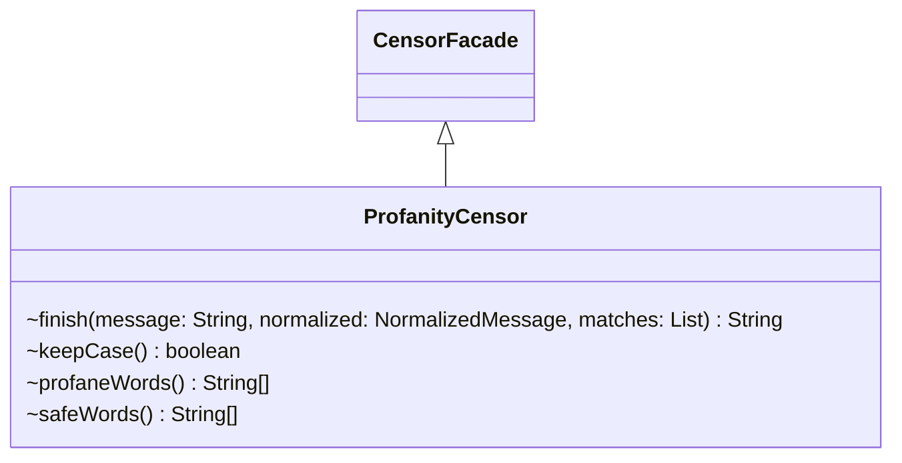

# CensorVariants.java

## Explanation

This file defines the ProfanityCensor class in the censor package. It belongs to src/censor in the COMP2100 MiniLab codebase and handles message censorship, profanity detection, and text filtering behavior. Key methods include finish, keepCase, profaneWords, safeWords.

## Complexity

Censoring generally scans the message and configured word lists, so complexity is typically O(n * w * k), where n is message length, w is number of watched words, and k is matched word length.

## UML



## Code
```java
package censor;

import java.util.List;

final class ProfanityCensor extends CensorFacade { }

final class BlockingCensor extends CensorFacade {
    @Override
    String finish(String message, NormalizedMessage normalized, List<CensorMatch> matches) {
        return matches.isEmpty() ? message : "[BLOCKED]";
    }
}

final class CaseSensitiveCensor extends CensorFacade {
    @Override
    boolean keepCase() {
        return true;
    }
}

final class BernardoCensor extends CensorFacade {
    @Override
    String[] profaneWords() {
        return WordLists.BERNARDO;
    }

    @Override
    String[] safeWords() {
        return WordLists.EMPTY;
    }
}

```
