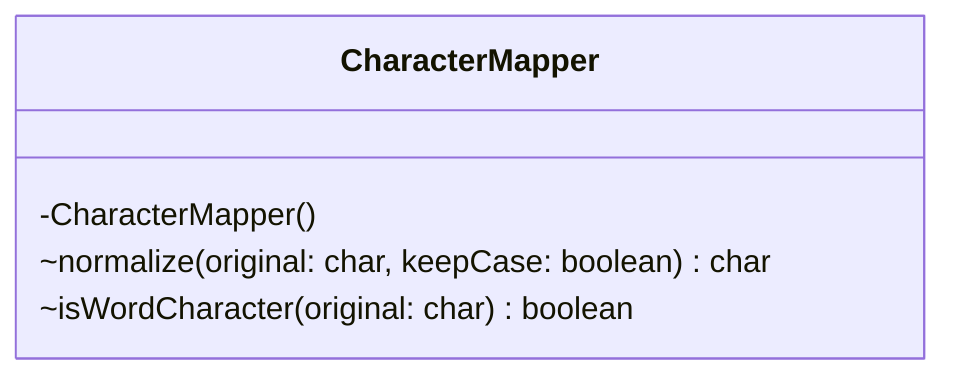

# CharacterMapper.java

## Explanation

This file defines the CharacterMapper class in the censor package. It belongs to src/censor in the COMP2100 MiniLab codebase and handles message censorship, profanity detection, and text filtering behavior. Key methods include normalize, isWordCharacter.

## Complexity

Censoring generally scans the message and configured word lists, so complexity is typically O(n * w * k), where n is message length, w is number of watched words, and k is matched word length.

## UML



## Code
```java
package censor;

final class CharacterMapper {
    private CharacterMapper() { }

    static char normalize(char original, boolean keepCase) {
        if (Character.isAlphabetic(original)) {
            return keepCase ? original : Character.toLowerCase(original);
        }
        switch (original) {
            case '1': case '|': case '\\': case '/': return 'l';
            case '3': return 'e';
            case '4': case '@': return 'a';
            case '5': case '$': return 's';
            case '6': return 'b';
            case '9': return 'g';
            case '0': return 'o';
            case '!': return 'i';
            default: return 0;
        }
    }

    static boolean isWordCharacter(char original) {
        return Character.isLetterOrDigit(original) || original == '\'' || normalize(original, false) != 0;
    }
}

```
