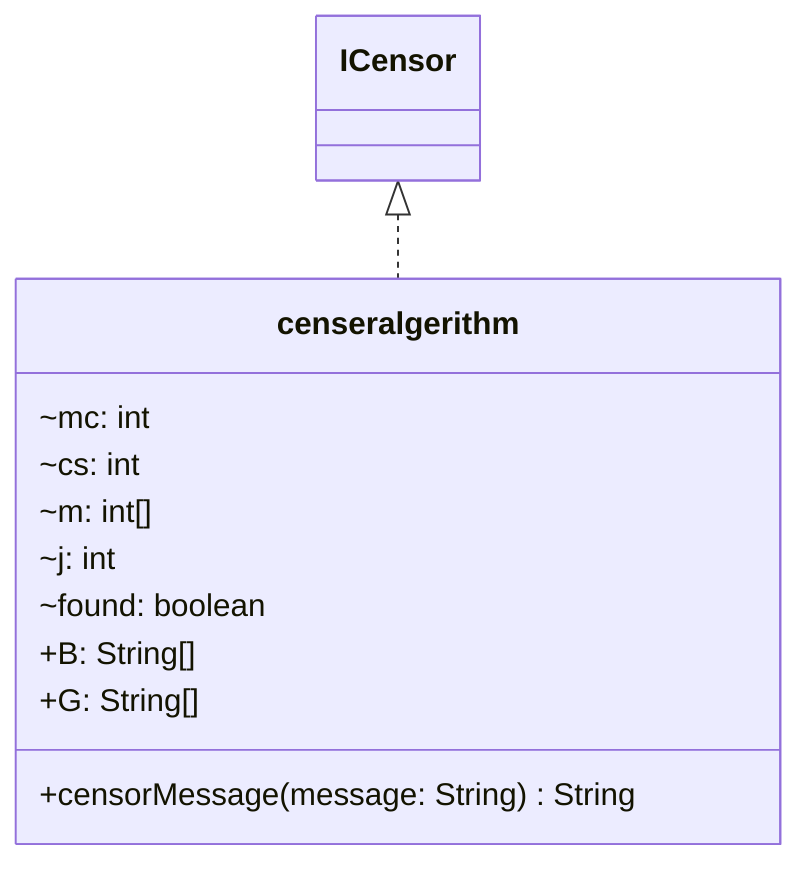

# censeralgerithm.java

## Path
src/censor/censeralgerithm.java

## Explanation

This file defines the censeralgerithm class in the censor package. It belongs to src/censor in the COMP2100 MiniLab codebase and handles message censorship, profanity detection, and text filtering behavior. Key methods include censorMessage.

## Complexity

Censoring generally scans the message and configured word lists, so complexity is typically O(n * w * k), where n is message length, w is number of watched words, and k is matched word length.

## UML



## Code
```java
package censor;

import java.util.ArrayList;
import java.util.Arrays;

public class censeralgerithm implements ICensor {
	public String censorMessage(String message) {
		String s = message.replaceAll("\\s+","");

		int mc = 0;
		int cs = 0;

		StringBuilder output = new StringBuilder();

		char[] f = new char[message.length()];
		int[] m = new int[f.length];
		char[] result = new char[message.length()];

		int j = 0;
		for (int i = 0; i < message.length(); i++) {
			result[i] = message.charAt(i);
			if (Character.isAlphabetic(message.charAt(i))) {
				f[j] = message.toLowerCase().charAt(i);
			} else if (message.charAt(i) == '1') {
				f[j] = 'l';
			} else if (message.charAt(i) == '3') {
				f[j] = 'e';
			} else if (message.charAt(i) == '4') {
				f[j] = 'a';
			} else if (message.charAt(i) == '5') {
				f[j] = 's';
			} else if (message.charAt(i) == '6') {
				f[j] = 'b';
			} else if (message.charAt(i) == '9') {
				f[j] = 'g';
			} else if (message.charAt(i) == '0') {
				f[j] = 'o';
			} else if (message.charAt(i) == '!') {
				f[j] = 'i';
			} else if (message.charAt(i) == '@') {
				f[j] = 'a';
			} else if (message.charAt(i) == '$') {
				f[j] = 's';
			} else if (message.charAt(i) == '|') {
				f[j] = 'l';
			} else if (message.charAt(i) == '\\') {
				// remember you need \\ to escape a \ in java string. i tjhink it looks similar lol
				f[j] = 'l';
			} else if (message.charAt(i) == '/') {
				f[j] = 'l';
			} else {
				continue;
			}
			m[j] = i;
			j++;
		}
		for (int k = 0; k < j; k++) {
			for (String word : B) {
				if (word.length() + k <= j) {
					if (new String(f).substring(k, word.length() + k).equals(word)) {
						for (int l = 1; l < word.length(); l++) {
							result[m[l + k]] = '*';
						}
					}
				}
			}
		}


		while (true) {
			if (mc >= message.length()) break;

			boolean found = false;

			char c = message.charAt(mc);
			if (String.valueOf(c).matches("\\s+")) {
				output.append(c);
				mc++;
				continue;
			}

			for (String word : G) {
				if (mc + word.length() >= message.length()) continue;
				String foundWord = message.substring(mc, mc + word.length() + 1);
				if (foundWord.equals(word + " ")) {
					found = true;
					break;
				}
			}
			if (!found) {
				for (String word : B) {
					String foundWord = s.substring(cs, Math.min(cs + word.length(), s.length()));
					if (foundWord.equals(word)) {
						found = true;
						int count = word.length();
						while (count > 0) {
							char c2 = message.charAt(mc);
							if (String.valueOf(c2).matches("\\s+")) {
								mc++;
								output.append(c2);
								continue;
							}
							if (count == word.length()) {
								output.append(c2);
							} else {
								output.append("*");
							}
							count--;
							mc++;
						}
						cs += word.length();
						break;
					}
				}
				if (found) {
					continue;
				}
			}

			output.append(c);
			mc++;
			cs++;
		}

		//return output.toString();

		for (int k = 0; k < j; k++) { for (String word : G) {if (word.length() + k < message.length() - 1) {if (message.toLowerCase().startsWith(word, k)) {
						for (int l = 1; l < word.length(); l++) {
							result[l + k] = message.charAt(k + l);
						}
					}
				}
			}
		}

		return new String(result);


	}

	public String[] B = {"hell", "crap", "damn"};
	public String[] G = {"aeroshell", "aeroshells", "bandshell", "bandshells", "bodyshell", "bodyshells", "bombshell", "bombshells", "bushelled", "busheller", "bushellers", "bushelling", "bushellings", "chellup", "chellups", "clamshell", "clamshells", "cockleshell", "cockleshells", "dayshell", "dayshells", "dratchell", "dratchells", "echelle", "echelles", "eggshell", "eggshells", "enshell", "enshelled", "enshelling", "enshells", "hardshell", "hatchelled", "hatcheller", "hatchellers", "hatchelling", "he'll", "hellacious", "hellaciously", "hellbender", "hellbenders", "hellbent", "hellbox", "hellboxes", "hellbroth", "hellbroths", "hellcat", "hellcats", "helldiver", "helldivers", "hellebore", "hellebores", "helleborine", "helleborines", "helled", "hellenisation", "hellenisations", "hellenise", "hellenised", "hellenises", "hellenising", "hellenization", "hellenizations", "hellenize", "hellenized", "hellenizes", "hellenizing", "heller", "helleri", "helleries", "helleris", "hellers", "hellery", "hellfire", "hellfires", "hellgramite", "hellgramites", "hellgrammite", "hellgrammites", "hellhole", "hellholes", "hellhound", "hellhounds", "hellicat", "hellicats", "hellier", "helliers", "helling", "hellion", "hellions", "hellish", "hellishly", "hellishness", "hellishnesses", "hellkite", "hellkites", "hello", "helloed", "helloes", "helloing", "hellos", "hellova", "hells", "helluva", "hellward", "hellwards", "inshell", "inshelled", "inshelling", "inshells", "lampshell", "lampshells", "mochell", "mochells", "muchell", "muchells", "nochelled", "nochelling", "notchelled", "notchelling", "nutshell", "nutshells", "orchella", "orchellas", "panhellenic", "panhellenion", "panhellenions", "panhellenium", "panhelleniums", "phellem", "phellems", "phelloderm", "phellodermal", "phelloderms", "phellogen", "phellogenetic", "phellogenic", "phellogens", "phelloid", "phelloplastic", "phelloplastics", "philhellene", "philhellenes", "philhellenic", "philhellenism", "philhellenisms", "philhellenist", "philhellenists", "rakehell", "rakehells", "rakehelly", "satchelled", "schellum", "schellums", "seashell", "seashells", "shell", "shellac", "shellack", "shellacked", "shellacker", "shellackers", "shellacking", "shellackings", "shellacks", "shellacs", "shellback", "shellbacks", "shellbark", "shellbarks", "shellbound", "shellcracker", "shellcrackers", "shelldrake", "shelldrakes", "shellduck", "shellducks", "shelled", "sheller", "shellers", "shellfire", "shellfires", "shellfish", "shellfisheries", "shellfishery", "shellfishes", "shellful", "shellfuls", "shellier", "shelliest", "shelliness", "shellinesses", "shelling", "shellings", "shellproof", "shells", "shellshock", "shellshocked", "shellshocks", "shellwork", "shellworks", "shelly", "shellycoat", "shellycoats", "softshell", "softshells", "stanchelled", "stanchelling", "subshell", "subshells", "toothshell", "toothshells", "tortoiseshell", "tortoiseshells", "unshell", "unshelled", "unshelling", "unshells", "zooxanthella", "zooxanthellae", "crapaud", "crapauds", "crape", "craped", "crapehanger", "crapehangers", "crapehanging", "crapehangings", "crapelike", "crapes", "crapier", "crapiest", "craping", "craple", "craples", "crapola", "crapolas", "crapped", "crapper", "crappers", "crappie", "crappier", "crappies", "crappiest", "crapping", "crappy", "craps", "crapshoot", "crapshooter", "crapshooters", "crapshoots", "crapulence", "crapulences", "crapulent", "crapulently", "crapulosities", "crapulosity", "crapulous", "crapulously", "crapulousness", "crapulousnesses", "crapy", "scrap", "scrapable", "scrapbook", "scrapbooks", "scrape", "scraped", "scrapegood", "scrapegoods", "scrapegut", "scrapeguts", "scrapepennies", "scrapepenny", "scraper", "scraperboard", "scraperboards", "scrapers", "scrapes", "scrapheap", "scrapheaps", "scrapie", "scrapies", "scraping", "scrapings", "scrappage", "scrappages", "scrapped", "scrapper", "scrappers", "scrappier", "scrappiest", "scrappily", "scrappiness", "scrappinesses", "scrapping", "scrapple", "scrapples", "scrappy", "scraps", "scrapyard", "scrapyards", "skyscraper", "skyscrapers"};
}

```
