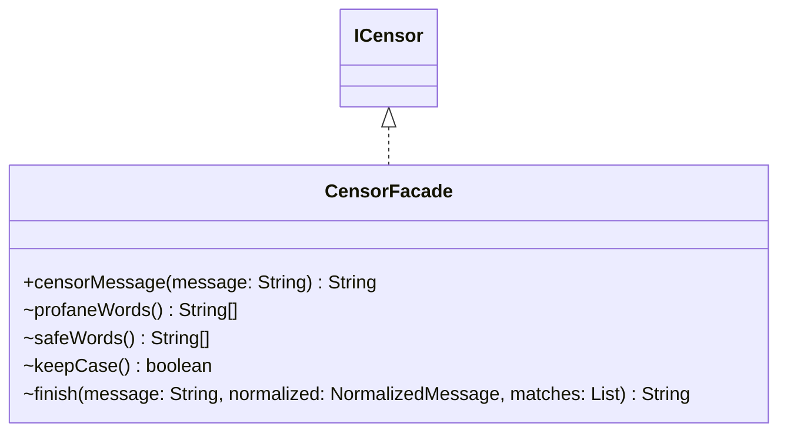

# CensorFacade.java

## Path
src/censor/CensorFacade.java

## Explanation

This file defines the CensorFacade class in the censor package. It belongs to src/censor in the COMP2100 MiniLab codebase and handles message censorship, profanity detection, and text filtering behavior. Key methods include censorMessage, profaneWords, safeWords, keepCase, finish.

## Complexity

Censoring generally scans the message and configured word lists, so complexity is typically O(n * w * k), where n is message length, w is number of watched words, and k is matched word length.

## UML



## Code
```java
package censor;

import java.util.List;

abstract class CensorFacade implements ICensor {
    /**
     * Runs the shared censoring algorithm while subclasses customise only the
     * configured words and final output policy.
     *
     * @param message the original message to process
     * @return the processed message after the selected censor policy is applied
     */
    public final String censorMessage(String message) {
        if (message == null) return null;
        NormalizedMessage normalized = new NormalizedMessage(message, keepCase());
        List<CensorMatch> matches = MatchFinder.find(normalized, profaneWords(), safeWords());
        return finish(message, normalized, matches);
    }

    String[] profaneWords() {
        return WordLists.PROFANITY;
    }

    String[] safeWords() {
        return WordLists.SAFE;
    }

    boolean keepCase() {
        return false;
    }

    String finish(String message, NormalizedMessage normalized, List<CensorMatch> matches) {
        return TextMasker.apply(message, normalized, matches);
    }
}

```
