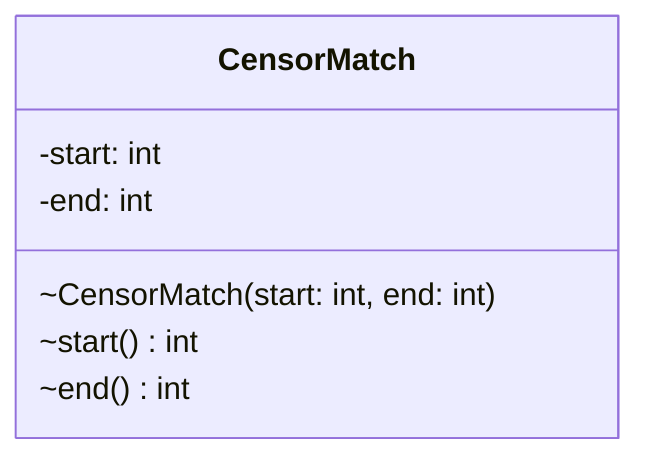

# CensorMatch.java

## Path
src/censor/CensorMatch.java

## Explanation

This file defines the CensorMatch class in the censor package. It belongs to src/censor in the COMP2100 MiniLab codebase and handles message censorship, profanity detection, and text filtering behavior. Key methods include start, end.

## Complexity

Censoring generally scans the message and configured word lists, so complexity is typically O(n * w * k), where n is message length, w is number of watched words, and k is matched word length.

## UML



## Code
```java
package censor;

final class CensorMatch {
    private final int start;
    private final int end;

    CensorMatch(int start, int end) {
        this.start = start;
        this.end = end;
    }

    int start() {
        return start;
    }

    int end() {
        return end;
    }
}

```
