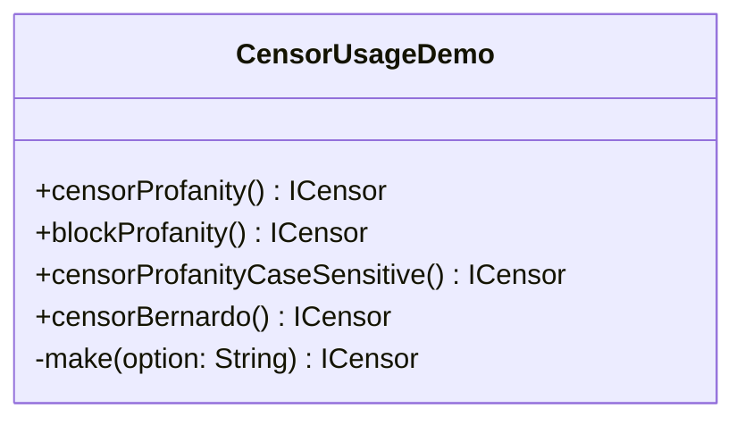

# CensorUsageDemo.java

## Path
src/censor/CensorUsageDemo.java

## Explanation

This file defines the CensorUsageDemo class in the censor package. It belongs to src/censor in the COMP2100 MiniLab codebase and handles message censorship, profanity detection, and text filtering behavior. Key methods include censorProfanity, blockProfanity, censorProfanityCaseSensitive, censorBernardo, make.

## Complexity

Censoring generally scans the message and configured word lists, so complexity is typically O(n * w * k), where n is message length, w is number of watched words, and k is matched word length.

## UML



## Code
```java
package censor;

public class CensorUsageDemo {
    /**
     * Creates the normal profanity censor used by the original module.
     *
     * @return a censor that replaces profanity letters with asterisks
     */
    public static ICensor censorProfanity() {
        return make("!");
    }

    /**
     * Creates a censor that blocks the whole message when profanity appears.
     *
     * @return a censor that returns a blocking message for profanity
     */
    public static ICensor blockProfanity() {
        return make("??");
    }

    /**
     * Creates a censor that only recognises lower case configured profanity.
     *
     * @return a case sensitive profanity censor
     */
    public static ICensor censorProfanityCaseSensitive() {
        return make("---");
    }

    /**
     * Creates a censor configured for the word Bernardo and its obfuscated forms.
     *
     * @return a Bernardo-specific censor
     */
    public static ICensor censorBernardo() {
        return make("++++");
    }

    private static ICensor make(String option) {
        switch (option.length()) {
            case 1: return new ProfanityCensor();
            case 2: return new BlockingCensor();
            case 3: return new CaseSensitiveCensor();
            default: return new BernardoCensor();
        }
    }
}

```
