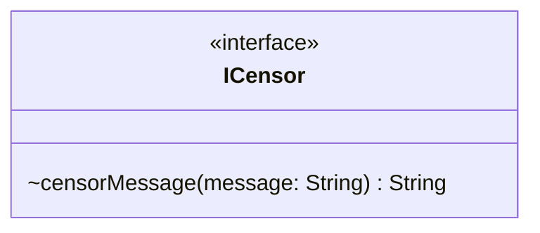

# ICensor.java

## Path
src/censor/ICensor.java

## Explanation

This file defines the ICensor interface in the censor package. It belongs to src/censor in the COMP2100 MiniLab codebase and handles message censorship, profanity detection, and text filtering behavior. Key methods include censorMessage.

## Complexity

Censoring generally scans the message and configured word lists, so complexity is typically O(n * w * k), where n is message length, w is number of watched words, and k is matched word length.

## UML



## Code
```java
package censor;

public interface ICensor {
    /**
     * Censors a given message while preserving the public module interface.
     *
     * @param message the message to censor
     * @return the censored message
     */
    String censorMessage(String message);
}

```
