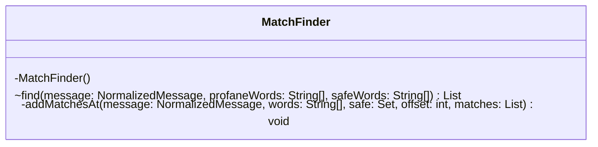

# MatchFinder.java

## Path
src/censor/MatchFinder.java

## Explanation

This file defines the MatchFinder class in the censor package. It belongs to src/censor in the COMP2100 MiniLab codebase and handles message censorship, profanity detection, and text filtering behavior. Key methods include find, addMatchesAt.

## Complexity

Censoring generally scans the message and configured word lists, so complexity is typically O(n * w * k), where n is message length, w is number of watched words, and k is matched word length.

## UML



## Code
```java
package censor;

import java.util.ArrayList;
import java.util.Arrays;
import java.util.HashSet;
import java.util.List;
import java.util.Set;

final class MatchFinder {
    private MatchFinder() { }

    static List<CensorMatch> find(NormalizedMessage message, String[] profaneWords, String[] safeWords) {
        List<CensorMatch> matches = new ArrayList<>();
        Set<String> safe = new HashSet<>(Arrays.asList(safeWords));
        for (int offset = 0; offset < message.length(); offset++) {
            addMatchesAt(message, profaneWords, safe, offset, matches);
        }
        return matches;
    }

    private static void addMatchesAt(NormalizedMessage message, String[] words,
                                     Set<String> safe, int offset, List<CensorMatch> matches) {
        for (String word : words) {
            if (!message.startsWith(word, offset)) continue;
            CensorMatch match = new CensorMatch(offset, offset + word.length());
            if (!safe.contains(message.rawWordAround(match))) matches.add(match);
        }
    }
}

```
