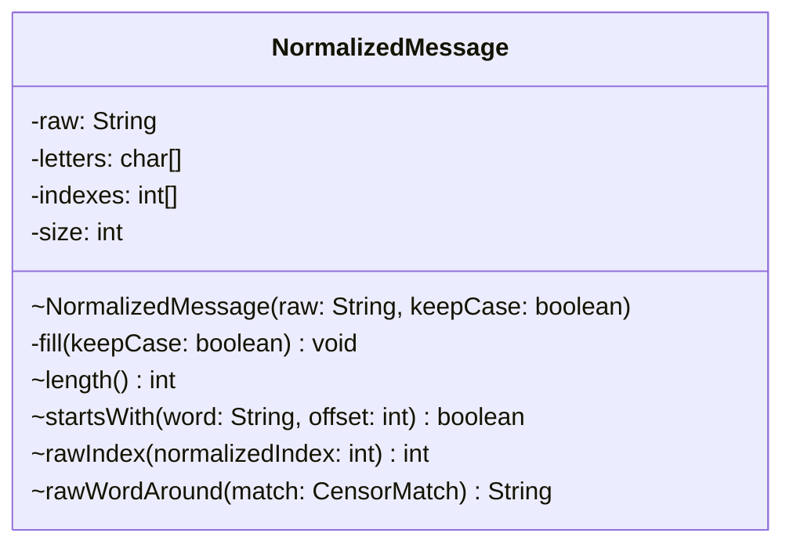

# NormalizedMessage.java

## Path
src/censor/NormalizedMessage.java

## Explanation

This file defines the NormalizedMessage class in the censor package. It belongs to src/censor in the COMP2100 MiniLab codebase and handles message censorship, profanity detection, and text filtering behavior. Key methods include fill, length, startsWith, rawIndex, rawWordAround.

## Complexity

Censoring generally scans the message and configured word lists, so complexity is typically O(n * w * k), where n is message length, w is number of watched words, and k is matched word length.

## UML



## Code
```java
package censor;

final class NormalizedMessage {
    private final String raw;
    private final char[] letters;
    private final int[] indexes;
    private int size;

    NormalizedMessage(String raw, boolean keepCase) {
        this.raw = raw;
        this.letters = new char[raw.length()];
        this.indexes = new int[raw.length()];
        fill(keepCase);
    }

    private void fill(boolean keepCase) {
        for (int i = 0; i < raw.length(); i++) {
            char normalized = CharacterMapper.normalize(raw.charAt(i), keepCase);
            if (normalized == 0) continue;
            letters[size] = normalized;
            indexes[size] = i;
            size++;
        }
    }

    int length() {
        return size;
    }

    boolean startsWith(String word, int offset) {
        if (offset + word.length() > size) return false;
        for (int i = 0; i < word.length(); i++) {
            if (letters[offset + i] != word.charAt(i)) return false;
        }
        return true;
    }

    int rawIndex(int normalizedIndex) {
        return indexes[normalizedIndex];
    }

    String rawWordAround(CensorMatch match) {
        int left = indexes[match.start()];
        int right = indexes[match.end() - 1];
        while (left > 0 && CharacterMapper.isWordCharacter(raw.charAt(left - 1))) left--;
        while (right + 1 < raw.length() && CharacterMapper.isWordCharacter(raw.charAt(right + 1))) right++;
        return raw.substring(left, right + 1).toLowerCase();
    }
}

```
