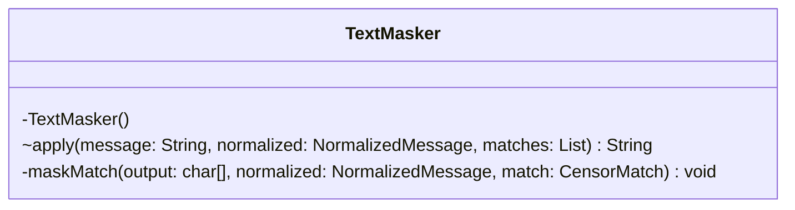

# TextMasker.java

## Path
src/censor/TextMasker.java

## Explanation

This file defines the TextMasker class in the censor package. It belongs to src/censor in the COMP2100 MiniLab codebase and handles message censorship, profanity detection, and text filtering behavior. Key methods include apply, maskMatch.

## Complexity

Censoring generally scans the message and configured word lists, so complexity is typically O(n * w * k), where n is message length, w is number of watched words, and k is matched word length.

## UML



## Code
```java
package censor;

import java.util.List;

final class TextMasker {
    private TextMasker() { }

    static String apply(String message, NormalizedMessage normalized, List<CensorMatch> matches) {
        char[] output = message.toCharArray();
        for (CensorMatch match : matches) maskMatch(output, normalized, match);
        return new String(output);
    }

    private static void maskMatch(char[] output, NormalizedMessage normalized, CensorMatch match) {
        for (int i = match.start() + 1; i < match.end(); i++) {
            output[normalized.rawIndex(i)] = '*';
        }
    }
}

```
