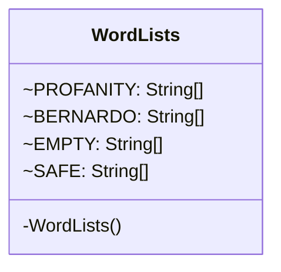

# WordLists.java

## Path
src/censor/WordLists.java

## Explanation

This file defines the WordLists class in the censor package. It belongs to src/censor in the COMP2100 MiniLab codebase and handles message censorship, profanity detection, and text filtering behavior.

## Complexity

Censoring generally scans the message and configured word lists, so complexity is typically O(n * w * k), where n is message length, w is number of watched words, and k is matched word length.

## UML



## Code
```java
package censor;

final class WordLists {
    static final String[] PROFANITY = {"hell", "crap", "damn"};
    static final String[] BERNARDO = {"bernardo"};
    static final String[] EMPTY = {};
    static final String[] SAFE = {"hello", "he'll", "scrap"};

    private WordLists() { }
}

```
