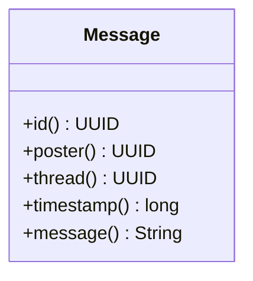

# Message.java

## Path
src/dao/model/Message.java

## Explanation

This file defines the Message record in the dao.model package. It stores the core data for a message: its id, poster, thread, timestamp, and text body.

## Complexity

The record accessors are O(1).

## UML



## Code
```java
package dao.model;

import java.util.UUID;

public record Message(UUID id, UUID poster, UUID thread, long timestamp, String message) {}
```
