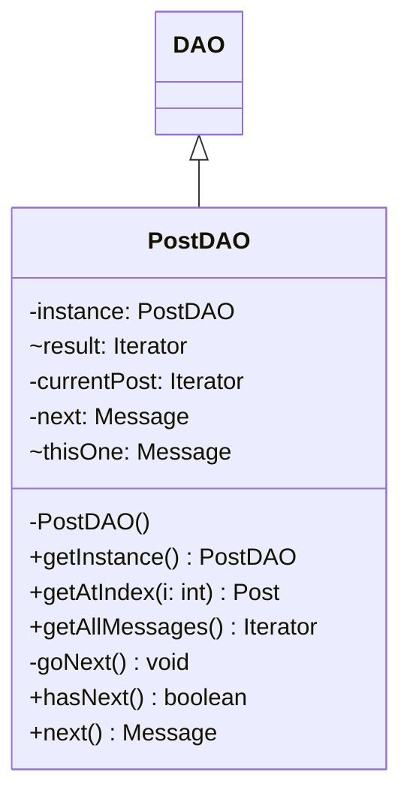

# PostDAO.java

## Path
src/dao/PostDAO.java

## Explanation

This file defines the PostDAO class in the dao package. It belongs to src/dao in the COMP2100 MiniLab codebase and separates data access responsibilities from application logic. Key methods include getInstance, getAtIndex, getAllMessages, goNext, hasNext.

## Complexity

DAO operation complexity depends on the backing storage. In-memory lookups may be O(1) with maps or O(n) with lists; file-backed operations may require O(n) scanning or serialization.

## UML



## Code
```java
package dao;

import dao.model.HasUUID;
import dao.model.Message;
import dao.model.Post;

import java.util.Comparator;
import java.util.Iterator;

public class PostDAO extends DAO<Post> {
	/**
	 * Generates a PostDAO by automatically building a Comparator that
	 * checks just that the UUID fields match. If you don't understand
	 * this syntax, don't worry. It's an advanced Java technique.
	 */
	private PostDAO() {
		super(Comparator.comparing(HasUUID::getUUID));
	}
	private static PostDAO instance;

	/**
	 * Gets a singleton instance of PostDAO, creating one if necessary.
	 * @return the instance
	 */
	public static PostDAO getInstance() {
		if (instance == null) instance = new PostDAO();
		return instance;
	}

	/**
	 * Gets the ith post, in order of timestamp
	 * @param i the index of the post to search for
	 * @return the post
	 */
	public Post getAtIndex(int i) {
		return data.getAtIndex(i);
	}

	/**
	 * Returns an Iterator that iterates through every message given as a reply to
	 * every post stored within the DAO, in no particular order.
	 * @return the iterator
	 */
	public Iterator<Message> getAllMessages() {
		Iterator<Message> result = null;
		result = new Iterator<>() {
			private final Iterator<Post> postIterator = getAll();
			private Iterator<Message> currentPost = null;
			private Message next = null;
			{
				goNext();
			}

			private void goNext() {
				while (currentPost == null || !currentPost.hasNext()) {
					if (postIterator.hasNext())
						currentPost = postIterator.next().messages.getAll();
					else {
						next = null;
						return;
					}
				}
				next = currentPost.next();
			}

			@Override
			public boolean hasNext() {
				return next != null;
			}

			@Override
			public Message next() {
				Message thisOne = next;
				goNext();
				return thisOne;
			}
		};
		return result;
	}
}

```
