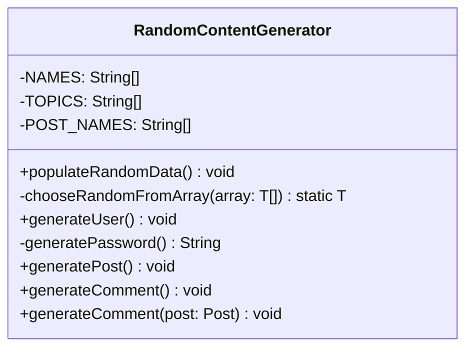

# RandomContentGenerator.java

## Path
src/dao/RandomContentGenerator.java

## Explanation

This file defines the RandomContentGenerator class in the dao package. It belongs to src/dao in the COMP2100 MiniLab codebase and separates data access responsibilities from application logic. Key methods include populateRandomData, chooseRandomFromArray, generateUser, generatePassword, generatePost.

## Complexity

DAO operation complexity depends on the backing storage. In-memory lookups may be O(1) with maps or O(n) with lists; file-backed operations may require O(n) scanning or serialization.

## UML



## Code
```java
package dao;

import dao.model.Message;
import dao.model.Post;
import dao.model.User;

import java.util.Random;
import java.util.UUID;

public class RandomContentGenerator {
	private static final String[] NAMES = new String[] {"Alexandria", "Beatrice", "Carmen", "Diego", "Ema", "Farah", "Georg", "Hadrian"};
	private static final String[] TOPICS = new String[] {"UML", "design patterns", "data structures", "persistent data",
			"modelling", "software construction", "exam", "mini project", "group project", "singleton", "observer",
			"factory", "strategy", "state", "facade", "DAO", "IntelliJ", "Android Studio", "AVL tree", "tree balancing",
			"concurrency"};
	private static final String[] POST_NAMES = new String[] {"Question about %s", "I love %s", "Study session: %s",
			"Practicing %s", "I don't understand %s", "Applications of %s", "How to implement %s?"};

	/**
	 * Fills the DAOs with a reasonable amount of data, for testing purposes
	 */
	public static void populateRandomData() {
		for (int i = 0; i < 200; i++) {
			RandomContentGenerator.generateUser();
		}

		for (int i = 0; i < 50; i++) {
			RandomContentGenerator.generatePost();
		}

		for (int i = 0; i < 25_000; i++) {
			RandomContentGenerator.generateComment();
		}
	}

	private static final Random random = new Random();

	/**
	 * Uniformly randomly selects an item from a generic array
	 * @param array the array of objects to choose from
	 * @return a random element, or a RuntimeException if array is empty or null
	 * @param <T> the type of array
	 */
	private static <T> T chooseRandomFromArray(T[] array) {
		if (array == null || array.length == 0)
			throw new RuntimeException("Targeted array is empty");
		return array[random.nextInt(array.length)];
	}

	public static void generateUser() {
		String username = chooseRandomFromArray(NAMES) + random.nextInt(1000);
		User.Role role = random.nextInt(4) == 0 ? User.Role.Admin : User.Role.Member;
		User user = new User(UUID.randomUUID(), role, username, generatePassword());
		UserDAO.getInstance().add(user);
	}

	private static String generatePassword() {
		return "password" + random.nextInt(10000);
	}

	public static void generatePost() {
		User user = UserDAO.getInstance().getRandom();
		if (user == null) return;
		String postName = chooseRandomFromArray(POST_NAMES).formatted(chooseRandomFromArray(TOPICS));
		Post post = new Post(UUID.randomUUID(), user.getUUID(), postName);
		PostDAO.getInstance().add(post);
	}

	public static void generateComment() {
		generateComment(PostDAO.getInstance().getRandom());
	}

	public static void generateComment(Post post) {
		User user = UserDAO.getInstance().getRandom();
		if (post == null || user == null) return;

		String content = "Hello from %s".formatted(user.username());

		long timestamp =  System.currentTimeMillis() - random.nextLong(200000);

		Message message = new Message(UUID.randomUUID(), user.getUUID(), post.getUUID(), timestamp, content);
		post.messages.insert(message);
	}
}

```
