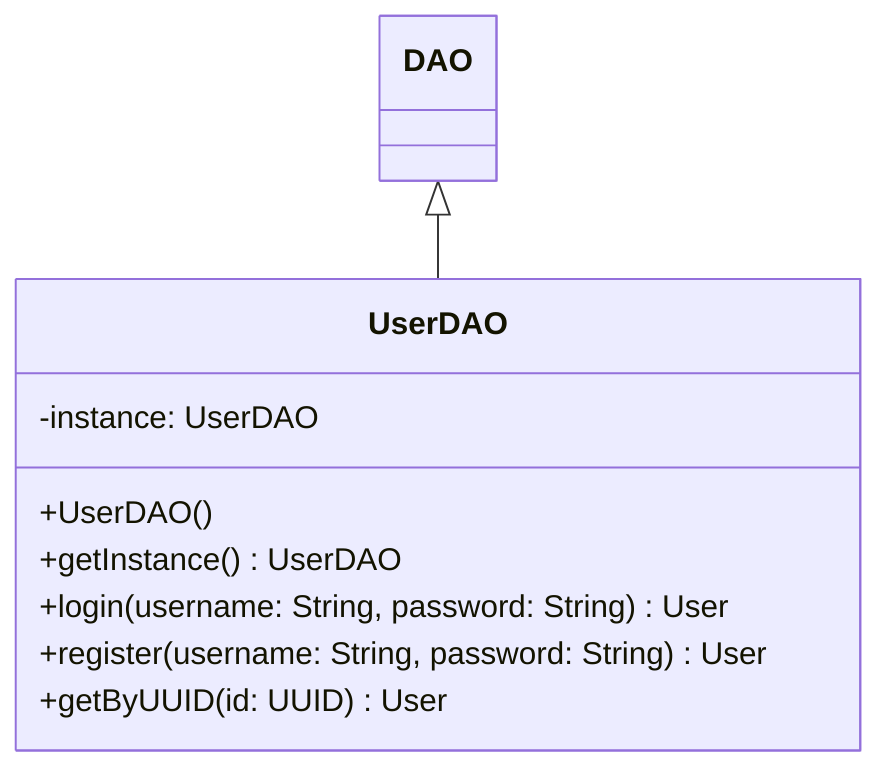

# UserDAO.java

## Path
src/dao/UserDAO.java

## Explanation

This file defines the UserDAO class in the dao package. It belongs to src/dao in the COMP2100 MiniLab codebase and separates data access responsibilities from application logic. Key methods include getInstance, login, register, getByUUID.

## Complexity

DAO operation complexity depends on the backing storage. In-memory lookups may be O(1) with maps or O(n) with lists; file-backed operations may require O(n) scanning or serialization.

## UML



## Code
```java
package dao;

import dao.model.User;

import java.util.Iterator;
import java.util.UUID;

public class UserDAO extends DAO<User> {
	// TODO: apply the Singleton design pattern to this class.
	// You may modify the existing constructor, add new constructors,
	// and add new helper method and private fields.
	/**
	 * Generates a UserDAO. We enforce uniqueness in usernames (but not in passwords),
	 * and further two usernames are considered identical if they are equal, ignoring case
	 */
	public UserDAO() {
		super((o1, o2) -> o1.username().compareToIgnoreCase(o2.username()));
	}
	
	private static UserDAO instance;
	public static UserDAO getInstance() {
		if (instance == null) instance = new UserDAO();
		return instance;
	}

	/**
	 * Attempts to authenticate as a particular user. If the user exists
	 * and their passwords match, the login is considered successful.
	 * @param username the username
	 * @param password the password
	 * @return the User if successful, null otherwise
	 */
	public User login(String username, String password) {
		User user = data.get(new User(username));
		return (user != null && user.password().equals(password)) ? user : null;
	}

	/**
	 * Attempts to register a new user. Users must have unique usernames,
	 * and their usernames must contain only alphanumeric characters.
	 * Usernames can be between 4 and 20 characters long.
	 * Passwords must be at least four characters long, and can include
	 * any codepoints.
	 * @param username the desired username
	 * @param password the desired password
	 * @return the newly-created User if successful, null otherwise
	 */
	public User register(String username, String password) {
		for (char c : username.toCharArray()) {
			if (!Character.isLetterOrDigit(c)) return null;
		}
		if (username.length() < 4 || username.length() > 20) return null;
		if (password.length() < 4) return null;

		User existingUser = data.get(new User(username));
		if (existingUser != null) return null;

		User newUser = new User(UUID.randomUUID(), User.Role.Member, username, password);
		return data.insert(newUser) ? newUser : null;
	}

	/**
	 * Fetches a User by just a UUID
	 * @param id the UUID to search for
	 * @return the user if they exist, else null
	 */
	public User getByUUID(UUID id) {
        for (Iterator<User> it = data.getAll(); it.hasNext(); ) {
            User user = it.next();
            if (user.getUUID().equals(id)) return user;
        }
		return null;
	}
}

```
