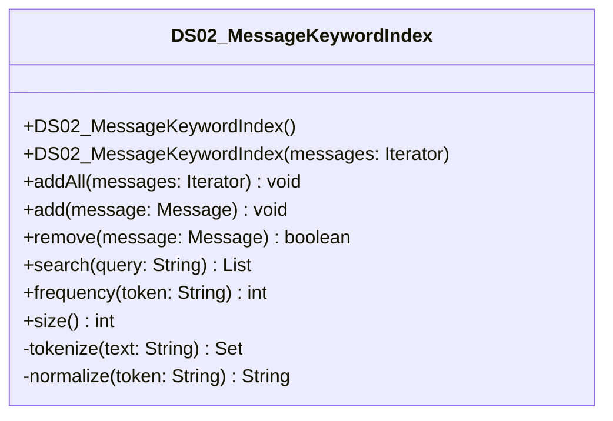

# DS02_MessageKeywordIndex.java

## Path
src/Mock_hackathon/DataStructures/DS02_MessageKeywordIndex.java

## Explanation

This file defines the DS02_MessageKeywordIndex class in the hackathon package. It belongs to src/Mock_hackathon/DataStructures in the COMP2100 MiniLab codebase and contains implementation logic for its codebase module. Key methods include addAll, add, remove, search, frequency.

## Complexity

Not specified.

## UML



## Code
```java
package hackathon;

import dao.model.Message;
import java.util.ArrayList;
import java.util.Collections;
import java.util.HashMap;
import java.util.Iterator;
import java.util.LinkedHashSet;
import java.util.List;
import java.util.Locale;
import java.util.Map;
import java.util.Set;

/**
 * DS02 practice implementation for message keyword inverted index.
 */
public class DS02_MessageKeywordIndex {
    private final Map<String, Set<Message>> index = new HashMap<>();
    private final Map<Message, Set<String>> reverseIndex = new HashMap<>();

    // Creates an empty message keyword index.
    public DS02_MessageKeywordIndex() {
    }

    // Adds all messages from an iterator to the index.
    public DS02_MessageKeywordIndex(Iterator<Message> messages) {
        addAll(messages);
    }

    // Adds every message from an iterator.
    public void addAll(Iterator<Message> messages) {
        if (messages == null) {
            return;
        }
        while (messages.hasNext()) {
            add(messages.next());
        }
    }

    // Adds one message to every token bucket found in its text.
    public void add(Message message) {
        if (message == null) {
            return;
        }
        remove(message);
        Set<String> tokens = tokenize(message.message());
        reverseIndex.put(message, tokens);
        for (String token : tokens) {
            index.computeIfAbsent(token, key -> new LinkedHashSet<>()).add(message);
        }
    }

    // Removes a message from every token bucket.
    public boolean remove(Message message) {
        Set<String> tokens = reverseIndex.remove(message);
        if (tokens == null) {
            return false;
        }
        for (String token : tokens) {
            Set<Message> bucket = index.get(token);
            if (bucket != null) {
                bucket.remove(message);
                if (bucket.isEmpty()) {
                    index.remove(token);
                }
            }
        }
        return true;
    }

    // Searches for messages containing all valid query tokens.
    public List<Message> search(String query) {
        Set<String> tokens = tokenize(query);
        if (tokens.isEmpty()) {
            return Collections.emptyList();
        }
        Iterator<String> iterator = tokens.iterator();
        Set<Message> result = new LinkedHashSet<>(index.getOrDefault(iterator.next(), Collections.emptySet()));
        while (iterator.hasNext()) {
            result.retainAll(index.getOrDefault(iterator.next(), Collections.emptySet()));
        }
        return new ArrayList<>(result);
    }

    // Returns how many messages contain a token.
    public int frequency(String token) {
        return index.getOrDefault(normalize(token), Collections.emptySet()).size();
    }

    // Returns the number of indexed messages.
    public int size() {
        return reverseIndex.size();
    }

    // Converts text into normalized unique tokens.
    private Set<String> tokenize(String text) {
        Set<String> tokens = new LinkedHashSet<>();
        if (text == null) {
            return tokens;
        }
        for (String raw : text.split("[^A-Za-z0-9]+")) {
            String token = normalize(raw);
            if (!token.isEmpty()) {
                tokens.add(token);
            }
        }
        return tokens;
    }

    // Normalizes a token for case-insensitive lookup.
    private String normalize(String token) {
        return token == null ? "" : token.toLowerCase(Locale.ROOT).trim();
    }
}

```
