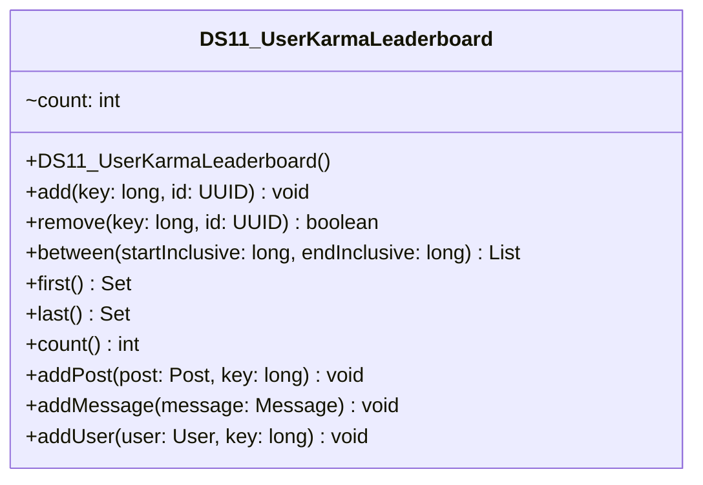

# DS11_UserKarmaLeaderboard.java

## Path
src/Mock_hackathon/DataStructures/DS11_UserKarmaLeaderboard.java

## Explanation

This file defines the DS11_UserKarmaLeaderboard class in the hackathon package. It belongs to src/Mock_hackathon/DataStructures in the COMP2100 MiniLab codebase and contains implementation logic for its codebase module. Key methods include add, remove, between, first, last.

## Complexity

Not specified.

## UML



## Code
```java
package hackathon;

import dao.model.Message;
import dao.model.Post;
import dao.model.User;
import java.util.ArrayList;
import java.util.Collections;
import java.util.LinkedHashSet;
import java.util.List;
import java.util.Objects;
import java.util.Set;
import java.util.TreeMap;
import java.util.UUID;
import sorteddata.avltree.AVLTree;
import sorteddata.bstree.BSTree;
import sorteddata.sortedarraylist.SortedArrayList;
import sorteddata.SortedData;
import sorteddata.SortedDataFactory;

/**
 * DS11 practice implementation for user karma leaderboard.
 */
public class DS11_UserKarmaLeaderboard {
    private final TreeMap<Long, Set<UUID>> values = new TreeMap<>();

    // Creates an empty range index.
    public DS11_UserKarmaLeaderboard() {
    }

    // Adds an id under a sortable key.
    public void add(long key, UUID id) {
        Objects.requireNonNull(id, "id");
        values.computeIfAbsent(key, ignored -> new LinkedHashSet<>()).add(id);
    }

    // Removes an id from a sortable key.
    public boolean remove(long key, UUID id) {
        Set<UUID> bucket = values.get(key);
        if (bucket == null || !bucket.remove(id)) {
            return false;
        }
        if (bucket.isEmpty()) {
            values.remove(key);
        }
        return true;
    }

    // Returns ids whose keys are inside the inclusive range.
    public List<UUID> between(long startInclusive, long endInclusive) {
        List<UUID> result = new ArrayList<>();
        for (Set<UUID> bucket : values.subMap(startInclusive, true, endInclusive, true).values()) {
            result.addAll(bucket);
        }
        return result;
    }

    // Returns ids at the smallest key.
    public Set<UUID> first() {
        return values.isEmpty() ? Collections.emptySet() : new LinkedHashSet<>(values.firstEntry().getValue());
    }

    // Returns ids at the largest key.
    public Set<UUID> last() {
        return values.isEmpty() ? Collections.emptySet() : new LinkedHashSet<>(values.lastEntry().getValue());
    }

    // Counts all ids in the range index.
    public int count() {
        int count = 0;
        for (Set<UUID> bucket : values.values()) {
            count += bucket.size();
        }
        return count;
    }
    // Adds a MiniLab Post under a supplied sortable key.
    public void addPost(Post post, long key) {
        if (post != null) {
            add(key, post.id);
        }
    }

    // Adds a MiniLab Message using its timestamp as the key.
    public void addMessage(Message message) {
        if (message != null) {
            add(message.timestamp(), message.id());
        }
    }

    // Adds a MiniLab User under a supplied sortable key.
    public void addUser(User user, long key) {
        if (user != null) {
            add(key, user.id());
        }
    }

    // Builds a SortedData snapshot using the original MiniLab factory.
    public SortedData<UUID> sortedSnapshot() {
        SortedData<UUID> snapshot = SortedDataFactory.makeSortedData(UUID::compareTo);
        for (UUID id : allIds()) {
            snapshot.insert(id);
        }
        return snapshot;
    }

    // Builds an AVLTree snapshot for diagramming AVL-backed indexes.
    public AVLTree<UUID> avlSnapshot() {
        AVLTree<UUID> snapshot = new AVLTree<>(UUID::compareTo);
        for (UUID id : allIds()) {
            snapshot.insert(id);
        }
        return snapshot;
    }

    // Builds a BSTree snapshot for comparing tree-backed indexes.
    public BSTree<UUID> bstSnapshot() {
        BSTree<UUID> snapshot = new BSTree<>(UUID::compareTo);
        for (UUID id : allIds()) {
            snapshot.insert(id);
        }
        return snapshot;
    }

    // Builds a SortedArrayList snapshot for array-backed indexes.
    public SortedArrayList<UUID> sortedArraySnapshot() {
        SortedArrayList<UUID> snapshot = new SortedArrayList<>(UUID::compareTo);
        for (UUID id : allIds()) {
            snapshot.insert(id);
        }
        return snapshot;
    }

    // Collects all ids in key order.
    private List<UUID> allIds() {
        List<UUID> ids = new ArrayList<>();
        for (Set<UUID> bucket : values.values()) {
            ids.addAll(bucket);
        }
        return ids;
    }


}

```
