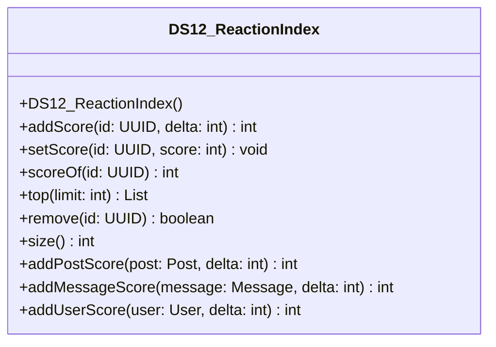

# DS12_ReactionIndex.java

## Path
src/Mock_hackathon/DataStructures/DS12_ReactionIndex.java

## Explanation

This file defines the DS12_ReactionIndex class in the hackathon package. It belongs to src/Mock_hackathon/DataStructures in the COMP2100 MiniLab codebase and contains implementation logic for its codebase module. Key methods include addScore, setScore, scoreOf, top, remove.

## Complexity

Not specified.

## UML



## Code
```java
package hackathon;

import dao.model.Message;
import dao.model.Post;
import dao.model.User;
import java.util.HashMap;
import java.util.List;
import java.util.Map;
import java.util.Objects;
import java.util.UUID;

/**
 * DS12 practice implementation for reaction index.
 */
public class DS12_ReactionIndex {
    private final Map<UUID, Integer> scores = new HashMap<>();

    // Creates an empty counter index.
    public DS12_ReactionIndex() {
    }

    // Adds a score delta to an id.
    public int addScore(UUID id, int delta) {
        Objects.requireNonNull(id, "id");
        int next = scoreOf(id) + delta;
        scores.put(id, next);
        return next;
    }

    // Sets an absolute score for an id.
    public void setScore(UUID id, int score) {
        Objects.requireNonNull(id, "id");
        scores.put(id, score);
    }

    // Returns the score for an id.
    public int scoreOf(UUID id) {
        return scores.getOrDefault(id, 0);
    }

    // Returns ids ordered by score descending.
    public List<UUID> top(int limit) {
        return scores.entrySet().stream()
            .sorted((left, right) -> Integer.compare(right.getValue(), left.getValue()))
            .limit(Math.max(0, limit))
            .map(Map.Entry::getKey)
            .toList();
    }

    // Removes an id from the counter.
    public boolean remove(UUID id) {
        return scores.remove(id) != null;
    }

    // Returns how many ids have scores.
    public int size() {
        return scores.size();
    }
    // Adds a score delta for a MiniLab Post.
    public int addPostScore(Post post, int delta) {
        return post == null ? 0 : addScore(post.id, delta);
    }

    // Adds a score delta for a MiniLab Message.
    public int addMessageScore(Message message, int delta) {
        return message == null ? 0 : addScore(message.id(), delta);
    }

    // Adds a score delta for a MiniLab User.
    public int addUserScore(User user, int delta) {
        return user == null ? 0 : addScore(user.id(), delta);
    }


}

```
