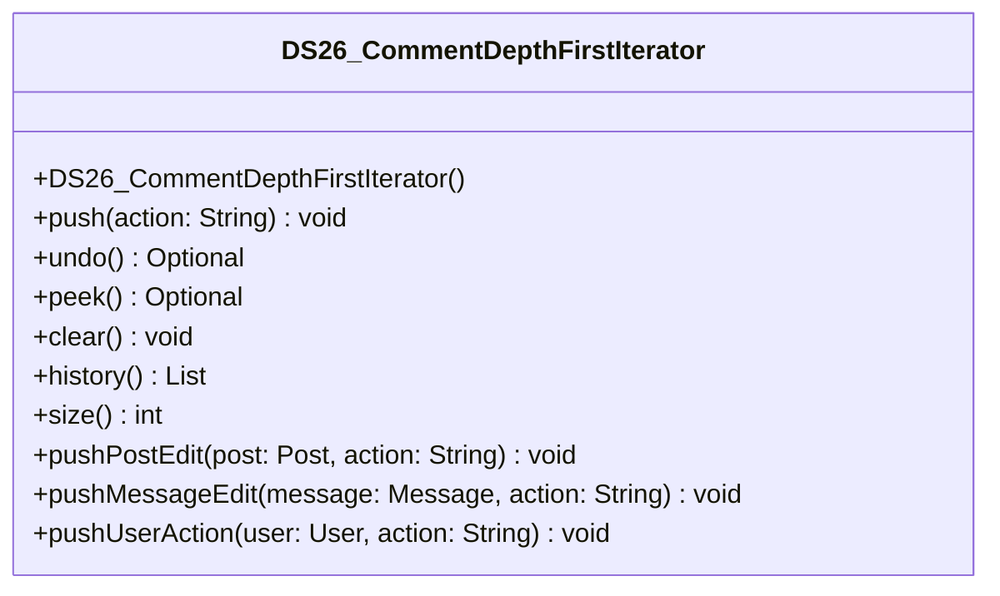

# DS26_CommentDepthFirstIterator.java

## Path
src/Mock_hackathon/DataStructures/DS26_CommentDepthFirstIterator.java

## Explanation

This file defines the DS26_CommentDepthFirstIterator class in the hackathon package. It belongs to src/Mock_hackathon/DataStructures in the COMP2100 MiniLab codebase and contains implementation logic for its codebase module. Key methods include push, undo, peek, clear, history.

## Complexity

Not specified.

## UML



## Code
```java
package hackathon;

import dao.model.Message;
import dao.model.Post;
import dao.model.User;
import java.util.ArrayDeque;
import java.util.ArrayList;
import java.util.Deque;
import java.util.List;
import java.util.Optional;

/**
 * DS26 practice implementation for comment depth-first iterator.
 */
public class DS26_CommentDepthFirstIterator {
    private final Deque<String> history = new ArrayDeque<>();

    // Creates an empty history stack.
    public DS26_CommentDepthFirstIterator() {
    }

    // Pushes a new action onto the stack.
    public void push(String action) {
        history.push(String.valueOf(action));
    }

    // Removes and returns the most recent action.
    public Optional<String> undo() {
        return history.isEmpty() ? Optional.empty() : Optional.of(history.pop());
    }

    // Returns the most recent action without removing it.
    public Optional<String> peek() {
        return history.isEmpty() ? Optional.empty() : Optional.of(history.peek());
    }

    // Clears all saved history.
    public void clear() {
        history.clear();
    }

    // Returns actions from newest to oldest.
    public List<String> history() {
        return new ArrayList<>(history);
    }

    // Returns the number of saved actions.
    public int size() {
        return history.size();
    }
    // Records an edit action for a MiniLab Post.
    public void pushPostEdit(Post post, String action) {
        if (post != null) {
            push("post:" + post.id + ":" + String.valueOf(action));
        }
    }

    // Records an edit action for a MiniLab Message.
    public void pushMessageEdit(Message message, String action) {
        if (message != null) {
            push("message:" + message.id() + ":" + String.valueOf(action));
        }
    }

    // Records an action performed by a MiniLab User.
    public void pushUserAction(User user, String action) {
        if (user != null) {
            push("user:" + user.id() + ":" + String.valueOf(action));
        }
    }


}

```
