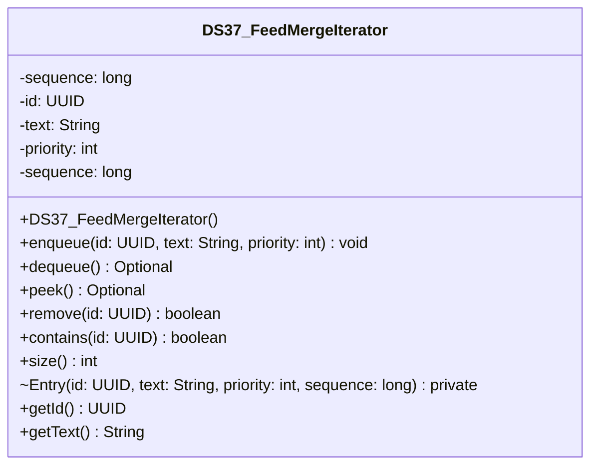

# DS37_FeedMergeIterator.java

## Path
src/Mock_hackathon/DataStructures/DS37_FeedMergeIterator.java

## Explanation

This file defines the DS37_FeedMergeIterator class in the hackathon package. It belongs to src/Mock_hackathon/DataStructures in the COMP2100 MiniLab codebase and contains implementation logic for its codebase module. Key methods include enqueue, dequeue, peek, remove, contains.

## Complexity

Not specified.

## UML



## Code
```java
package hackathon;

import dao.model.Message;
import dao.model.Post;
import dao.model.User;
import java.util.HashMap;
import java.util.Map;
import java.util.Objects;
import java.util.Optional;
import java.util.PriorityQueue;
import java.util.UUID;

/**
 * DS37 practice implementation for feed merge iterator.
 */
public class DS37_FeedMergeIterator {
    private final PriorityQueue<Entry> queue = new PriorityQueue<>();
    private final Map<UUID, Entry> entries = new HashMap<>();
    private long sequence;

    // Creates an empty priority queue.
    public DS37_FeedMergeIterator() {
    }

    // Adds or replaces an item with a priority.
    public void enqueue(UUID id, String text, int priority) {
        Objects.requireNonNull(id, "id");
        remove(id);
        Entry entry = new Entry(id, String.valueOf(text), priority, sequence++);
        entries.put(id, entry);
        queue.add(entry);
    }

    // Removes and returns the highest-priority item.
    public Optional<Entry> dequeue() {
        Entry entry = queue.poll();
        if (entry == null) {
            return Optional.empty();
        }
        entries.remove(entry.id);
        return Optional.of(entry);
    }

    // Returns the next item without removing it.
    public Optional<Entry> peek() {
        return Optional.ofNullable(queue.peek());
    }

    // Removes a queued item by id.
    public boolean remove(UUID id) {
        Entry entry = entries.remove(id);
        return entry != null && queue.remove(entry);
    }

    // Checks whether an id is currently queued.
    public boolean contains(UUID id) {
        return entries.containsKey(id);
    }

    // Returns the number of queued items.
    public int size() {
        return entries.size();
    }

    public static class Entry implements Comparable<Entry> {
        private final UUID id;
        private final String text;
        private final int priority;
        private final long sequence;

        // Creates an immutable queue entry.
        private Entry(UUID id, String text, int priority, long sequence) {
            this.id = id;
            this.text = text;
            this.priority = priority;
            this.sequence = sequence;
        }

        // Returns the queued item id.
        public UUID getId() {
            return id;
        }

        // Returns the queued item text.
        public String getText() {
            return text;
        }

        // Returns the queued item priority.
        public int getPriority() {
            return priority;
        }

        // Orders entries by priority and insertion sequence.
        @Override
        public int compareTo(Entry other) {
            int byPriority = Integer.compare(other.priority, priority);
            return byPriority != 0 ? byPriority : Long.compare(sequence, other.sequence);
        }
    }
    // Queues a MiniLab Post using its id and topic.
    public void enqueuePost(Post post, int priority) {
        if (post != null) {
            enqueue(post.id, post.topic, priority);
        }
    }

    // Queues a MiniLab Message using its id and body.
    public void enqueueMessage(Message message, int priority) {
        if (message != null) {
            enqueue(message.id(), message.message(), priority);
        }
    }

    // Queues a MiniLab User using its id and username.
    public void enqueueUser(User user, int priority) {
        if (user != null) {
            enqueue(user.id(), user.username(), priority);
        }
    }


}

```
