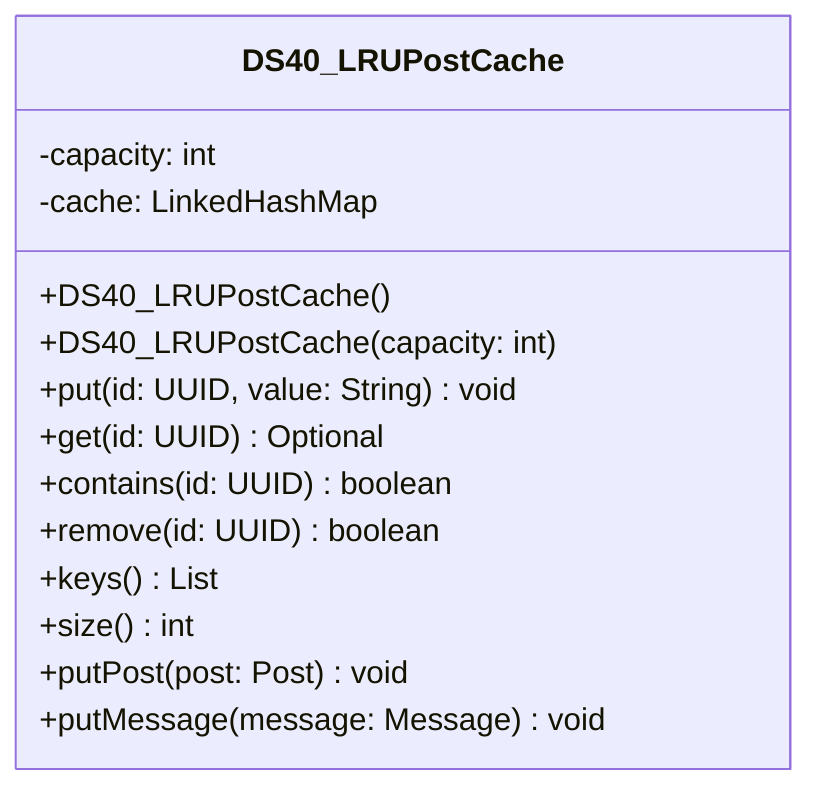

# DS40_LRUPostCache.java

## Path
src/Mock_hackathon/DataStructures/DS40_LRUPostCache.java

## Explanation

This file defines the DS40_LRUPostCache class in the hackathon package. It belongs to src/Mock_hackathon/DataStructures in the COMP2100 MiniLab codebase and contains implementation logic for its codebase module. Key methods include put, get, contains, remove, keys.

## Complexity

Not specified.

## UML



## Code
```java
package hackathon;

import dao.model.Message;
import dao.model.Post;
import dao.model.User;
import java.util.ArrayList;
import java.util.Iterator;
import java.util.LinkedHashMap;
import java.util.List;
import java.util.Objects;
import java.util.Optional;
import java.util.UUID;

/**
 * DS40 practice implementation for lRU post cache.
 */
public class DS40_LRUPostCache {
    private final int capacity;
    private final LinkedHashMap<UUID, String> cache;

    // Creates a cache with default capacity.
    public DS40_LRUPostCache() {
        this(3);
    }

    // Creates a cache with a fixed positive capacity.
    public DS40_LRUPostCache(int capacity) {
        if (capacity <= 0) {
            throw new IllegalArgumentException("capacity must be positive");
        }
        this.capacity = capacity;
        this.cache = new LinkedHashMap<>(16, 0.75f, true);
    }

    // Saves a value and evicts the oldest entry when full.
    public void put(UUID id, String value) {
        cache.put(Objects.requireNonNull(id, "id"), String.valueOf(value));
        while (cache.size() > capacity) {
            Iterator<UUID> iterator = cache.keySet().iterator();
            iterator.next();
            iterator.remove();
        }
    }

    // Returns a cached value and refreshes recency.
    public Optional<String> get(UUID id) {
        return Optional.ofNullable(cache.get(id));
    }

    // Checks whether the cache contains an id.
    public boolean contains(UUID id) {
        return cache.containsKey(id);
    }

    // Removes a cached id.
    public boolean remove(UUID id) {
        return cache.remove(id) != null;
    }

    // Returns ids from least to most recently used.
    public List<UUID> keys() {
        return new ArrayList<>(cache.keySet());
    }

    // Returns the number of cached values.
    public int size() {
        return cache.size();
    }
    // Stores a MiniLab Post topic in the cache.
    public void putPost(Post post) {
        if (post != null) {
            put(post.id, post.topic);
        }
    }

    // Stores a MiniLab Message body in the cache.
    public void putMessage(Message message) {
        if (message != null) {
            put(message.id(), message.message());
        }
    }

    // Stores a MiniLab User username in the cache.
    public void putUser(User user) {
        if (user != null) {
            put(user.id(), user.username());
        }
    }


}

```
