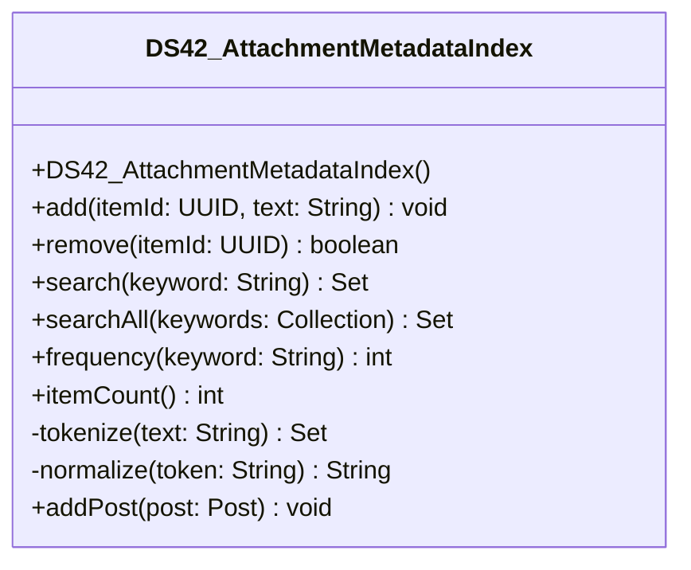

# DS42_AttachmentMetadataIndex.java

## Path
src/Mock_hackathon/DataStructures/DS42_AttachmentMetadataIndex.java

## Explanation

This file defines the DS42_AttachmentMetadataIndex class in the hackathon package. It belongs to src/Mock_hackathon/DataStructures in the COMP2100 MiniLab codebase and contains implementation logic for its codebase module. Key methods include add, remove, search, searchAll, frequency.

## Complexity

Not specified.

## UML



## Code
```java
package hackathon;

import dao.model.Message;
import dao.model.Post;
import dao.model.User;
import java.util.Collection;
import java.util.Collections;
import java.util.HashMap;
import java.util.Iterator;
import java.util.LinkedHashSet;
import java.util.Locale;
import java.util.Map;
import java.util.Objects;
import java.util.Set;
import java.util.UUID;

/**
 * DS42 practice implementation for attachment metadata index.
 */
public class DS42_AttachmentMetadataIndex {
    private final Map<String, Set<UUID>> index = new HashMap<>();
    private final Map<UUID, Set<String>> reverseIndex = new HashMap<>();

    // Creates an empty keyword-style index.
    public DS42_AttachmentMetadataIndex() {
    }

    // Adds an item to every token bucket found in the text.
    public void add(UUID itemId, String text) {
        Objects.requireNonNull(itemId, "itemId");
        remove(itemId);
        Set<String> tokens = tokenize(text);
        reverseIndex.put(itemId, tokens);
        for (String token : tokens) {
            index.computeIfAbsent(token, key -> new LinkedHashSet<>()).add(itemId);
        }
    }

    // Removes an item from all token buckets.
    public boolean remove(UUID itemId) {
        Set<String> tokens = reverseIndex.remove(itemId);
        if (tokens == null) {
            return false;
        }
        for (String token : tokens) {
            Set<UUID> bucket = index.get(token);
            if (bucket != null) {
                bucket.remove(itemId);
                if (bucket.isEmpty()) {
                    index.remove(token);
                }
            }
        }
        return true;
    }

    // Returns matching item ids for one normalized keyword.
    public Set<UUID> search(String keyword) {
        String token = normalize(keyword);
        if (token.isEmpty()) {
            return Collections.emptySet();
        }
        return new LinkedHashSet<>(index.getOrDefault(token, Collections.emptySet()));
    }

    // Returns item ids that match every keyword.
    public Set<UUID> searchAll(Collection<String> keywords) {
        if (keywords == null || keywords.isEmpty()) {
            return Collections.emptySet();
        }
        Iterator<String> iterator = keywords.iterator();
        Set<UUID> result = search(iterator.next());
        while (iterator.hasNext()) {
            result.retainAll(search(iterator.next()));
        }
        return result;
    }

    // Returns how many items contain the keyword.
    public int frequency(String keyword) {
        return search(keyword).size();
    }

    // Returns the number of indexed items.
    public int itemCount() {
        return reverseIndex.size();
    }

    // Splits text into normalized unique tokens.
    private Set<String> tokenize(String text) {
        Set<String> tokens = new LinkedHashSet<>();
        for (String raw : String.valueOf(text).split("[^A-Za-z0-9]+")) {
            String token = normalize(raw);
            if (!token.isEmpty()) {
                tokens.add(token);
            }
        }
        return tokens;
    }

    // Normalizes a token for lookup.
    private String normalize(String token) {
        return String.valueOf(token).toLowerCase(Locale.ROOT).trim();
    }
    // Adds a MiniLab Post by indexing its topic text.
    public void addPost(Post post) {
        if (post != null) {
            add(post.id, post.topic);
        }
    }

    // Adds a MiniLab Message by indexing its message text.
    public void addMessage(Message message) {
        if (message != null) {
            add(message.id(), message.message());
        }
    }

    // Adds a MiniLab User by indexing its username.
    public void addUser(User user) {
        if (user != null) {
            add(user.id(), user.username());
        }
    }


}

```
