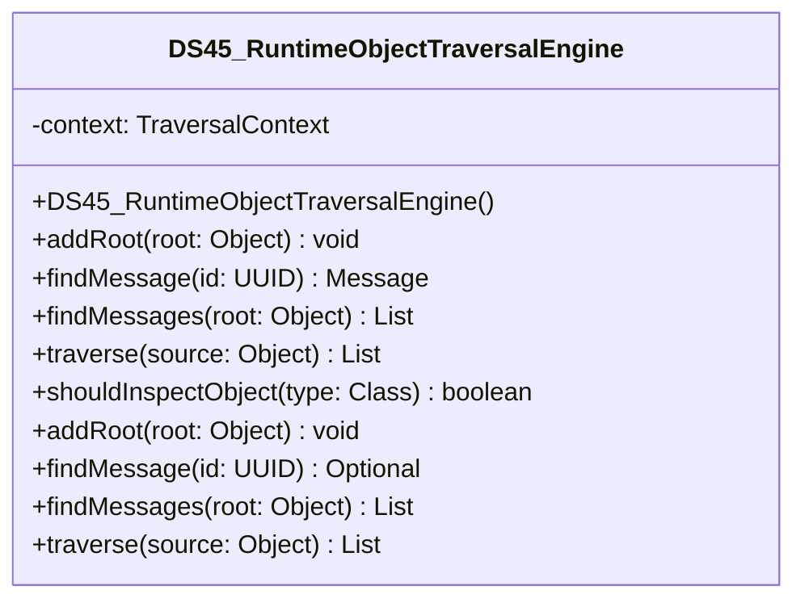

# DS45_RuntimeObjectTraversalEngine.java

## Path
src/Mock_hackathon/DataStructures/DS45_RuntimeObjectTraversalEngine.java

## Explanation

This file defines the DS45_RuntimeObjectTraversalEngine class in the hackathon package. It belongs to src/Mock_hackathon/DataStructures in the COMP2100 MiniLab codebase and contains implementation logic for its codebase module. Key methods include addRoot, findMessage, findMessages, traverse, shouldInspectObject.

## Complexity

Not specified.

## UML



## Code
```java
package hackathon;

import dao.model.Message;
import java.lang.reflect.Array;
import java.lang.reflect.Field;
import java.lang.reflect.InvocationTargetException;
import java.lang.reflect.Method;
import java.lang.reflect.Modifier;
import java.util.ArrayList;
import java.util.Arrays;
import java.util.Collections;
import java.util.IdentityHashMap;
import java.util.Iterator;
import java.util.LinkedHashSet;
import java.util.List;
import java.util.Map;
import java.util.Objects;
import java.util.Optional;
import java.util.Set;
import java.util.UUID;

/**
 * DS45 practice implementation for runtime object graph traversal engine.
 */
public class DS45_RuntimeObjectTraversalEngine {
    private final MessageFinder finder = new MessageFinder();

    // Creates an empty runtime traversal entry point.
    public DS45_RuntimeObjectTraversalEngine() {
    }

    // Registers a root object that can be searched by id.
    public void addRoot(Object root) {
        finder.addRoot(root);
    }

    // Searches known container shapes and project objects for a matching message
    public Message findMessage(UUID id) {
        return finder.findMessage(id).orElse(null);
    }

    // Finds every message reachable from a supplied runtime root.
    public List<Message> findMessages(Object root) {
        return finder.findMessages(root);
    }

    // Traverses a runtime object graph and returns discovered messages.
    public List<Message> traverse(Object source) {
        return finder.traverse(source);
    }

    // Checks whether a type is worth inspecting through accessors or fields.
    public boolean shouldInspectObject(Class<?> type) {
        return finder.shouldInspectObject(type);
    }
}

class MessageFinder {
    private final List<Object> roots = new ArrayList<>();
    private final ObjectTraversalEngine engine = new ObjectTraversalEngine();

    // Registers one root object for later id-based searches.
    public void addRoot(Object root) {
        if (root != null) {
            roots.add(root);
        }
    }

    // Searches known container shapes and project objects for a matching message
    public Optional<Message> findMessage(UUID id) {
        if (id == null) {
            return Optional.empty();
        }
        for (Object root : roots) {
            for (Message message : findMessages(root)) {
                if (id.equals(message.id())) {
                    return Optional.of(message);
                }
            }
        }
        return Optional.empty();
    }

    // Finds every Message record reachable from one runtime root.
    public List<Message> findMessages(Object root) {
        return engine.traverse(root);
    }

    // Delegates traversal to the reusable object graph engine.
    public List<Message> traverse(Object source) {
        return engine.traverse(source);
    }

    // Exposes the traversal type filter for direct tests.
    public boolean shouldInspectObject(Class<?> type) {
        return engine.shouldInspectObject(type);
    }
}

class ObjectTraversalEngine {
    // Starts a fresh traversal context for one object graph.
    public List<Message> traverse(Object source) {
        TraversalContext context = new TraversalContext();
        new RuntimeObjectWalker(context).traverse(source);
        return context.messages();
    }

    // Checks whether runtime reflection should inspect the supplied type.
    public boolean shouldInspectObject(Class<?> type) {
        return RuntimeObjectWalker.shouldInspectObject(type);
    }
}

class TraversalContext {
    private final Set<Object> visitedObjects = Collections.newSetFromMap(new IdentityHashMap<>());
    private final Set<UUID> seenMessageIds = new LinkedHashSet<>();
    private final List<Message> messages = new ArrayList<>();

    // Marks an object as visited using identity rather than equals.
    public boolean markVisited(Object value) {
        return visitedObjects.add(value);
    }

    // Adds a message once even when the same object is reachable twice.
    public void addMessage(Message message) {
        if (message == null) {
            return;
        }
        UUID id = message.id();
        if (id != null && seenMessageIds.add(id)) {
            messages.add(message);
        } else if (id == null && !messages.contains(message)) {
            messages.add(message);
        }
    }

    // Returns discovered messages in traversal order.
    public List<Message> messages() {
        return new ArrayList<>(messages);
    }
}

class RuntimeObjectWalker {
    private static final Set<String> SAFE_ACCESSOR_NAMES = new LinkedHashSet<>(Arrays.asList(
        "getAll",
        "iterator",
        "messages",
        "getMessages",
        "values",
        "toArray"
    ));

    private final TraversalContext context;

    // Creates a walker bound to one traversal context.
    public RuntimeObjectWalker(TraversalContext context) {
        this.context = Objects.requireNonNull(context, "context");
    }

    // Searches known container shapes and project objects for a matching message
    public void traverse(Object source) {
        if (source == null) {
            return;
        }
        if (source instanceof Message) {
            context.addMessage((Message) source);
            return;
        }
        if (!context.markVisited(source)) {
            return;
        }
        if (source instanceof Iterator<?>) {
            findMessageInIterator((Iterator<?>) source);
            return;
        }
        if (source instanceof Iterable<?>) {
            findMessageInIterable((Iterable<?>) source);
            return;
        }
        if (source instanceof Map<?, ?>) {
            findMessageInMap((Map<?, ?>) source);
            return;
        }
        if (source.getClass().isArray()) {
            findMessageInArray(source);
            return;
        }
        if (!shouldInspectObject(source.getClass())) {
            return;
        }
        findMessageFromAccessor(source);
        findMessageFromFields(source);
    }

    // Checks whether a runtime type can safely expose project object state.
    public static boolean shouldInspectObject(Class<?> type) {
        if (type == null) {
            return false;
        }
        if (Message.class.isAssignableFrom(type)) {
            return true;
        }
        if (type.isArray()) {
            return true;
        }
        if (Iterator.class.isAssignableFrom(type) || Iterable.class.isAssignableFrom(type) || Map.class.isAssignableFrom(type)) {
            return true;
        }
        if (type.isPrimitive() || type.isEnum() || type.isAnnotation() || type == Class.class) {
            return false;
        }
        if (Number.class.isAssignableFrom(type)
            || CharSequence.class.isAssignableFrom(type)
            || Boolean.class == type
            || Character.class == type
            || UUID.class == type) {
            return false;
        }
        Package typePackage = type.getPackage();
        String packageName = typePackage == null ? "" : typePackage.getName();
        return !(packageName.startsWith("java.")
            || packageName.startsWith("javax.")
            || packageName.startsWith("jdk.")
            || packageName.startsWith("sun."));
    }

    // Traverses an iterator without assuming a particular sorted-data implementation
    void findMessageInIterator(Iterator<?> iterator) {
        while (iterator != null && iterator.hasNext()) {
            traverse(iterator.next());
        }
    }

    // Traverses iterable containers such as lists or DAO-exposed collections
    void findMessageInIterable(Iterable<?> iterable) {
        if (iterable != null) {
            findMessageInIterator(iterable.iterator());
        }
    }

    // Traverses map keys and values in case a DAO stores objects by UUID
    void findMessageInMap(Map<?, ?> map) {
        if (map == null) {
            return;
        }
        for (Map.Entry<?, ?> entry : map.entrySet()) {
            traverse(entry.getKey());
            traverse(entry.getValue());
        }
    }

    // Traverses arrays while keeping the object graph search implementation shared
    void findMessageInArray(Object array) {
        int length = Array.getLength(array);
        for (int index = 0; index < length; index++) {
            traverse(Array.get(array, index));
        }
    }

    // Uses common no-argument accessors exposed by DAO and sorted-data classes
    void findMessageFromAccessor(Object source) {
        for (Method method : source.getClass().getMethods()) {
            if (isSafeAccessor(method)) {
                findMessageFromAccessor(source, method);
            }
        }
    }

    // Invokes one safe accessor and searches the returned value
    void findMessageFromAccessor(Object source, Method method) {
        Object returnedValue = invokeAccessor(source, method);
        if (returnedValue != source) {
            traverse(returnedValue);
        }
    }

    // Searches fields on project objects, including inherited DAO storage fields
    void findMessageFromFields(Object source) {
        Class<?> current = source.getClass();
        while (current != null && current != Object.class) {
            for (Field field : current.getDeclaredFields()) {
                if (!Modifier.isStatic(field.getModifiers())) {
                    traverse(readFieldValue(source, field));
                }
            }
            current = current.getSuperclass();
        }
    }

    // Reads a single instance field and searches its value when accessible
    Object readFieldValue(Object source, Field field) {
        try {
            if (!field.canAccess(source) && !field.trySetAccessible()) {
                return null;
            }
            return field.get(source);
        } catch (IllegalAccessException | SecurityException error) {
            return null;
        }
    }

    // Checks whether a method is a safe traversal accessor.
    private boolean isSafeAccessor(Method method) {
        return method.getParameterCount() == 0
            && method.getReturnType() != Void.TYPE
            && !Modifier.isStatic(method.getModifiers())
            && method.getDeclaringClass() != Object.class
            && SAFE_ACCESSOR_NAMES.contains(method.getName());
    }

    // Invokes one accessor and ignores methods that fail at runtime.
    private Object invokeAccessor(Object source, Method method) {
        try {
            if (!method.canAccess(source) && !method.trySetAccessible()) {
                return null;
            }
            return method.invoke(source);
        } catch (IllegalAccessException | InvocationTargetException | SecurityException error) {
            return null;
        }
    }
}

```
