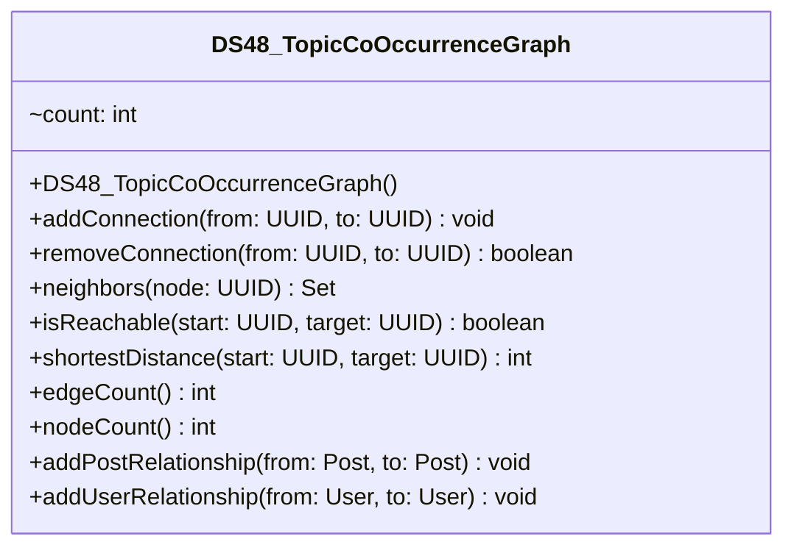

# DS48_TopicCoOccurrenceGraph.java

## Path
src/Mock_hackathon/DataStructures/DS48_TopicCoOccurrenceGraph.java

## Explanation

This file defines the DS48_TopicCoOccurrenceGraph class in the hackathon package. It belongs to src/Mock_hackathon/DataStructures in the COMP2100 MiniLab codebase and contains implementation logic for its codebase module. Key methods include addConnection, removeConnection, neighbors, isReachable, shortestDistance.

## Complexity

Not specified.

## UML



## Code
```java
package hackathon;

import dao.model.Message;
import dao.model.Post;
import dao.model.User;
import java.util.ArrayDeque;
import java.util.Collections;
import java.util.HashMap;
import java.util.LinkedHashMap;
import java.util.LinkedHashSet;
import java.util.Map;
import java.util.Objects;
import java.util.Queue;
import java.util.Set;
import java.util.UUID;

/**
 * DS48 practice implementation for topic co-occurrence graph.
 */
public class DS48_TopicCoOccurrenceGraph {
    private final Map<UUID, Set<UUID>> adjacency = new LinkedHashMap<>();

    // Creates an empty directed graph.
    public DS48_TopicCoOccurrenceGraph() {
    }

    // Adds a directed connection between two ids.
    public void addConnection(UUID from, UUID to) {
        Objects.requireNonNull(from, "from");
        Objects.requireNonNull(to, "to");
        adjacency.computeIfAbsent(from, key -> new LinkedHashSet<>()).add(to);
        adjacency.computeIfAbsent(to, key -> new LinkedHashSet<>());
    }

    // Removes a directed connection if it exists.
    public boolean removeConnection(UUID from, UUID to) {
        Set<UUID> targets = adjacency.get(from);
        return targets != null && targets.remove(to);
    }

    // Returns neighbors reachable in one step.
    public Set<UUID> neighbors(UUID node) {
        return new LinkedHashSet<>(adjacency.getOrDefault(node, Collections.emptySet()));
    }

    // Checks whether a target can be reached from a start node.
    public boolean isReachable(UUID start, UUID target) {
        return shortestDistance(start, target) >= 0;
    }

    // Returns the shortest unweighted distance or -1 when unreachable.
    public int shortestDistance(UUID start, UUID target) {
        if (Objects.equals(start, target) && adjacency.containsKey(start)) {
            return 0;
        }
        Queue<UUID> queue = new ArrayDeque<>();
        Map<UUID, Integer> distance = new HashMap<>();
        queue.add(start);
        distance.put(start, 0);
        while (!queue.isEmpty()) {
            UUID current = queue.remove();
            for (UUID next : adjacency.getOrDefault(current, Collections.emptySet())) {
                if (distance.containsKey(next)) {
                    continue;
                }
                int nextDistance = distance.get(current) + 1;
                if (next.equals(target)) {
                    return nextDistance;
                }
                distance.put(next, nextDistance);
                queue.add(next);
            }
        }
        return -1;
    }

    // Counts directed edges in the graph.
    public int edgeCount() {
        int count = 0;
        for (Set<UUID> targets : adjacency.values()) {
            count += targets.size();
        }
        return count;
    }

    // Counts known nodes in the graph.
    public int nodeCount() {
        return adjacency.size();
    }
    // Adds a graph edge between two MiniLab posts.
    public void addPostRelationship(Post from, Post to) {
        if (from != null && to != null) {
            addConnection(from.id, to.id);
        }
    }

    // Adds a graph edge between two MiniLab users.
    public void addUserRelationship(User from, User to) {
        if (from != null && to != null) {
            addConnection(from.id(), to.id());
        }
    }

    // Adds a graph edge from a message thread to the message id.
    public void addThreadMessage(Message message) {
        if (message != null) {
            addConnection(message.thread(), message.id());
        }
    }


}

```
