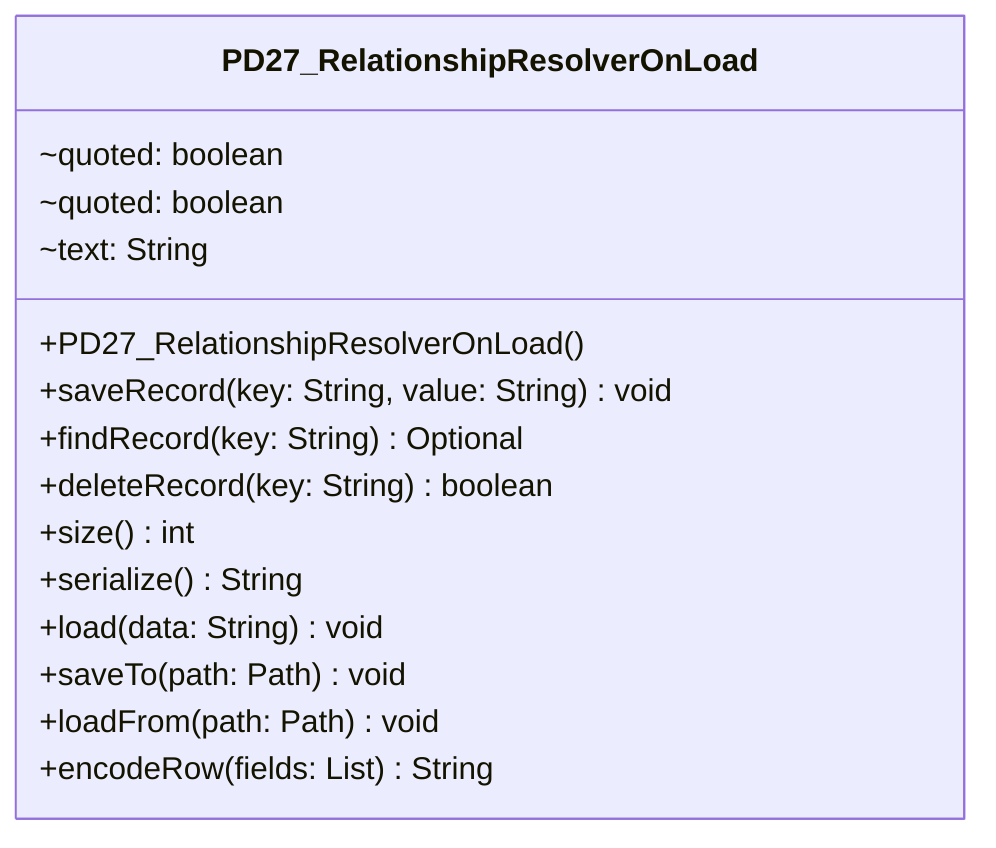

# PD27_RelationshipResolverOnLoad.java

## Path
src/Mock_hackathon/PersistentData_Mock/PD27_RelationshipResolverOnLoad.java

## Explanation

This file defines the PD27_RelationshipResolverOnLoad class in the hackathon package. It belongs to src/Mock_hackathon/PersistentData_Mock in the COMP2100 MiniLab codebase and contains implementation logic for its codebase module. Key methods include saveRecord, findRecord, deleteRecord, size, serialize.

## Complexity

Not specified.

## UML



## Code
```java
package hackathon;

import java.io.IOException;
import java.io.StringReader;
import java.io.StringWriter;
import java.nio.charset.StandardCharsets;
import java.nio.file.Files;
import java.nio.file.Path;
import java.util.ArrayList;
import java.util.Arrays;
import java.util.LinkedHashMap;
import java.util.List;
import java.util.Map;
import java.util.Optional;
import persistentdata.DataManager;
import persistentdata.DataPipeline;
import persistentdata.formatted.CSVFormat;
import persistentdata.formatted.CSVFormattedFactory;
import persistentdata.formatted.CSVReader;
import persistentdata.formatted.CSVWriter;
import persistentdata.formatted.FormattedFactory;
import persistentdata.formatted.FormattedReader;
import persistentdata.formatted.FormattedWriter;
import persistentdata.io.ComputerIOFactory;
import persistentdata.io.IOFactory;
import persistentdata.serialization.Serializer;

/**
 * PD27 practice implementation for relationship resolver on load.
 */
public class PD27_RelationshipResolverOnLoad {
    private final Map<String, String> records = new LinkedHashMap<>();

    // Creates an empty persistence helper.
    public PD27_RelationshipResolverOnLoad() {
    }

    // Saves one key-value record.
    public void saveRecord(String key, String value) {
        validateKey(key);
        records.put(key, value == null ? "" : value);
    }

    // Returns a saved record by key.
    public Optional<String> findRecord(String key) {
        return Optional.ofNullable(records.get(key));
    }

    // Deletes a saved record by key.
    public boolean deleteRecord(String key) {
        return records.remove(key) != null;
    }

    // Returns how many records are stored.
    public int size() {
        return records.size();
    }

    // Serializes records to escaped CSV text.
    public String serialize() {
        List<String> rows = new ArrayList<>();
        for (Map.Entry<String, String> entry : records.entrySet()) {
            rows.add(encodeRow(Arrays.asList(entry.getKey(), entry.getValue())));
        }
        return String.join("\n", rows);
    }

    // Loads records from escaped CSV text.
    public void load(String data) {
        records.clear();
        for (String row : splitRows(String.valueOf(data))) {
            if (row.isBlank()) {
                continue;
            }
            List<String> fields = decodeRow(row);
            if (fields.size() != 2) {
                throw new IllegalArgumentException("Each row must contain key and value");
            }
            saveRecord(fields.get(0), fields.get(1));
        }
    }

    // Writes serialized records to a file.
    public void saveTo(Path path) throws IOException {
        Files.writeString(path, serialize(), StandardCharsets.UTF_8);
    }

    // Reads serialized records from a file.
    public void loadFrom(Path path) throws IOException {
        load(Files.readString(path, StandardCharsets.UTF_8));
    }

    // Encodes one CSV row with robust escaping.
    public String encodeRow(List<String> fields) {
        List<String> encoded = new ArrayList<>();
        for (String field : fields) {
            encoded.add(escape(field));
        }
        return String.join(",", encoded);
    }

    // Decodes one escaped CSV row.
    public List<String> decodeRow(String row) {
        List<String> fields = new ArrayList<>();
        StringBuilder current = new StringBuilder();
        boolean quoted = false;
        for (int index = 0; index < row.length(); index++) {
            char ch = row.charAt(index);
            if (quoted) {
                if (ch == '"' && index + 1 < row.length() && row.charAt(index + 1) == '"') {
                    current.append('"');
                    index++;
                } else if (ch == '"') {
                    quoted = false;
                } else {
                    current.append(ch);
                }
            } else if (ch == ',') {
                fields.add(current.toString());
                current.setLength(0);
            } else if (ch == '"') {
                quoted = true;
            } else {
                current.append(ch);
            }
        }
        if (quoted) {
            throw new IllegalArgumentException("Unterminated quoted field");
        }
        fields.add(current.toString());
        return fields;
    }

    // Splits serialized CSV into rows while respecting quoted newlines.
    private List<String> splitRows(String data) {
        List<String> rows = new ArrayList<>();
        StringBuilder current = new StringBuilder();
        boolean quoted = false;
        for (int index = 0; index < data.length(); index++) {
            char ch = data.charAt(index);
            if (ch == '"') {
                quoted = !quoted || (index + 1 < data.length() && data.charAt(index + 1) == '"');
                current.append(ch);
                if (index + 1 < data.length() && data.charAt(index + 1) == '"') {
                    current.append(data.charAt(++index));
                }
            } else if (ch == '\n' && !quoted) {
                rows.add(current.toString());
                current.setLength(0);
            } else {
                current.append(ch);
            }
        }
        rows.add(current.toString());
        return rows;
    }

    // Escapes one CSV field when needed.
    private String escape(String value) {
        String text = value == null ? "" : value;
        if (text.contains(",") || text.contains("\"") || text.contains("\n")) {
            return "\"" + text.replace("\"", "\"\"") + "\"";
        }
        return text;
    }

    // Rejects blank record keys.
    private void validateKey(String key) {
        if (key == null || key.isBlank()) {
            throw new IllegalArgumentException("key is required");
        }
    }
    // Returns the original MiniLab DataManager singleton for integration points.
    public DataManager miniLabDataManager() {
        return DataManager.getInstance();
    }

    // Creates the original MiniLab CSV formatted factory for a column count.
    public FormattedFactory<String[]> csvFactory(int columns) {
        return new CSVFormattedFactory(new CSVFormat(columns));
    }

    // Creates a serializer for this helper's key-value records.
    public Serializer<Map.Entry<String, String>, String[]> recordSerializer() {
        return new KeyValueSerializer();
    }

    // Creates a DataPipeline using the original MiniLab persistence abstractions.
    public DataPipeline<Map.Entry<String, String>, String[]> pipeline(String filename) {
        IOFactory ioFactory = new ComputerIOFactory();
        return new DataPipeline<>(ioFactory, csvFactory(2), recordSerializer(), filename);
    }

    // Reads CSV rows through the original MiniLab CSVReader.
    public List<String[]> readCsvRows(String data, int columns) {
        FormattedReader<String[]> reader = new CSVReader(new CSVFormat(columns), new StringReader(String.valueOf(data)));
        List<String[]> rows = new ArrayList<>();
        while (reader.hasNext()) {
            rows.add(reader.getNext());
        }
        return rows;
    }

    // Writes CSV rows through the original MiniLab CSVWriter.
    public String writeCsvRows(List<String[]> rows, int columns) {
        StringWriter output = new StringWriter();
        FormattedWriter<String[]> writer = new CSVWriter(new CSVFormat(columns), output);
        for (String[] row : rows) {
            writer.putNext(row);
        }
        writer.putFooter();
        return output.toString();
    }

    private static class KeyValueSerializer implements Serializer<Map.Entry<String, String>, String[]> {
        // Serializes one key-value record into a two-column row.
        public String[] serialize(Map.Entry<String, String> object) {
            return new String[] { object.getKey(), object.getValue() };
        }

        // Deserializes one two-column row into a key-value record.
        public Map.Entry<String, String> deserialize(String[] data) {
            return new java.util.AbstractMap.SimpleEntry<>(data[0], data[1]);
        }
    }


}

```
