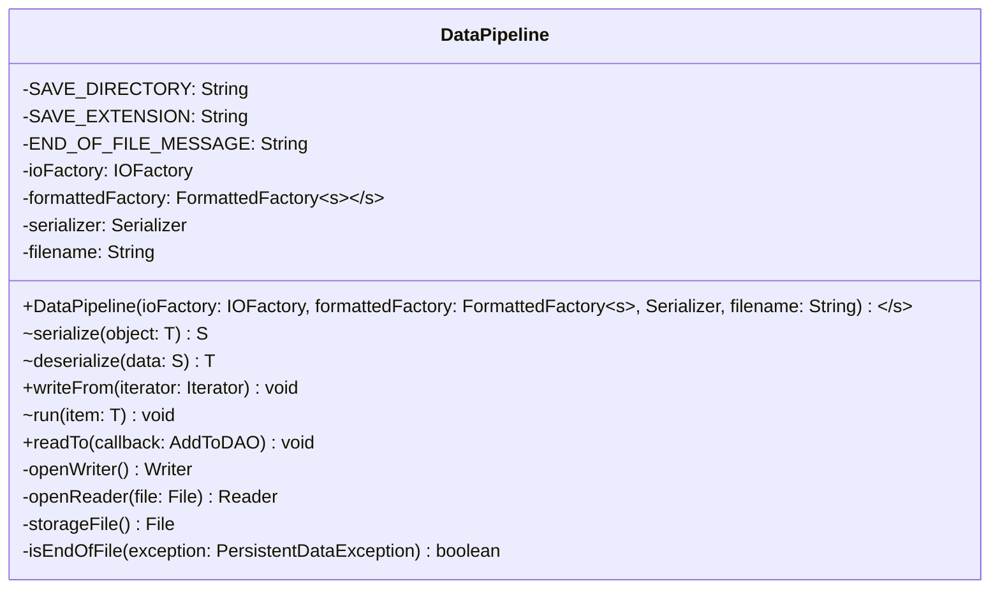

# DataPipeline.java

## Path
src/persistentdata/DataPipeline.java

## Explanation

This file defines the DataPipeline class in the persistentdata package. It belongs to src/persistentdata in the COMP2100 MiniLab codebase and contains implementation logic for its codebase module. Key methods include serialize, deserialize, writeFrom, run, readTo.

## Complexity

Not specified.

## UML



## Code
```java
package persistentdata;

import persistentdata.formatted.FormattedFactory;
import persistentdata.formatted.FormattedReader;
import persistentdata.formatted.FormattedWriter;
import persistentdata.io.IOFactory;

import java.io.File;
import java.io.FileReader;
import java.io.FileWriter;
import java.io.IOException;
import java.io.Reader;
import java.io.Writer;
import java.util.Iterator;

public class DataPipeline<T, S> {
	private static final String SAVE_DIRECTORY = "saved";
	private static final String SAVE_EXTENSION = ".txt";
	private static final String END_OF_FILE_MESSAGE = "Already reached end of file while reading";

	private final IOFactory ioFactory;
	private final FormattedFactory<S> formattedFactory;
	private final Serializer<T, S> serializer;
	private final String filename;

	/**
	 * Converts model objects to and from the portable values handled by formatted storage.
	 */
	public interface Serializer<T, S> {
		S serialize(T object);

		T deserialize(S data);
	}

	public DataPipeline(IOFactory ioFactory, FormattedFactory<S> formattedFactory, Serializer<T, S> serializer, String filename) {
		this.ioFactory = ioFactory;
		this.formattedFactory = formattedFactory;
		this.serializer = serializer;
		this.filename = filename;
	}


	public void writeFrom(Iterator<T> iterator) {
		try (Writer writer = openWriter()) {
			FormattedWriter<S> formattedWriter = formattedFactory.writer(writer);

			while (iterator.hasNext()) {
				formattedWriter.putNext(serializer.serialize(iterator.next()));
			}
		} catch (IOException e) {
			throw new PersistentDataException(e.getMessage());
		}
	}

	public interface AddToDAO<T> {
		void run(T item);
	}

	public void readTo(AddToDAO<T> callback) {
		File file = storageFile();
		if (!file.exists() || file.length() == 0) {
			return;
		}

		try (Reader reader = openReader(file)) {
			FormattedReader<S> formattedReader = formattedFactory.reader(reader);

			while (true) {
				try {
					callback.run(serializer.deserialize(formattedReader.getNext()));
				} catch (PersistentDataException e) {
					if (isEndOfFile(e)) {
						return;
					}
					throw e;
				}
			}
		} catch (IOException e) {
			throw new PersistentDataException(e.getMessage());
		}
	}

	private Writer openWriter() throws IOException {
		File file = storageFile();
		File directory = file.getParentFile();
		if (directory != null && !directory.exists() && !directory.mkdirs()) {
			throw new PersistentDataException("Could not create save directory");
		}

		Writer writer = ioFactory.writer(filename);
		return writer == null ? new FileWriter(file) : writer;
	}

	private Reader openReader(File file) throws IOException {
		Reader reader = ioFactory.reader(filename);
		return reader == null ? new FileReader(file) : reader;
	}

	private File storageFile() {
		return new File(SAVE_DIRECTORY, filename + SAVE_EXTENSION);
	}

	private static boolean isEndOfFile(PersistentDataException exception) {
		return END_OF_FILE_MESSAGE.equals(exception.getMessage());
	}
}

```
