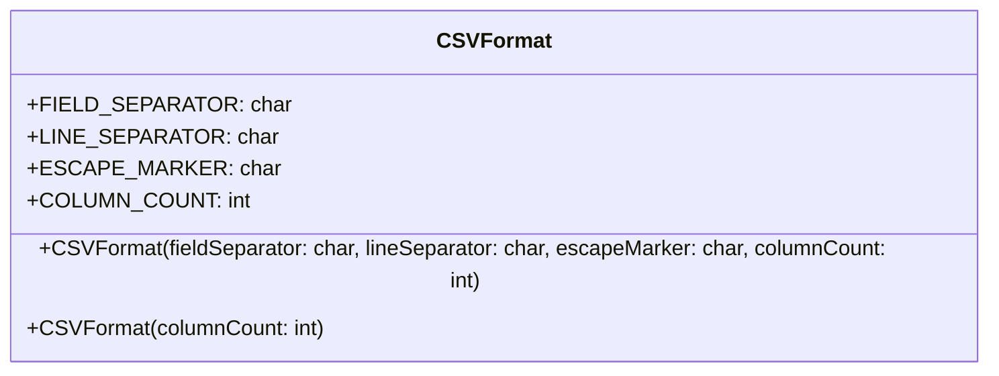

# CSVFormat.java

## Path
src/persistentdata/formatted/CSVFormat.java

## Explanation

This file defines the CSVFormat class in the persistentdata.formatted package. It belongs to src/persistentdata/formatted in the COMP2100 MiniLab codebase and handles formatted file input or output for persistent data.

## Complexity

Reading is typically O(n) in the size of the input file.

## UML



## Code
```java
package persistentdata.formatted;

/**
 * Specifies the layout of a particular CSV document, including
 * which characters are used to separate fields, lines, and escape
 * specially-delimited fields, as well as the number of columns.
 */
public final class CSVFormat {
	public final char FIELD_SEPARATOR;
	public final char LINE_SEPARATOR;
	public final char ESCAPE_MARKER;
	public final int COLUMN_COUNT;

	public CSVFormat(char fieldSeparator, char lineSeparator, char escapeMarker, int columnCount) {
		if (fieldSeparator == lineSeparator || fieldSeparator == escapeMarker || lineSeparator == escapeMarker)
			throw new RuntimeException("The three special delimiters in CSVFormat must be different");
		this.FIELD_SEPARATOR = fieldSeparator;
		this.LINE_SEPARATOR = lineSeparator;
		this.ESCAPE_MARKER = escapeMarker;
		this.COLUMN_COUNT = columnCount;
	}

	/**
	 * It is perfectly acceptable to provide just a column count,
	 * in which case the default symbols are used:
	 * - comma ',' for field separators
	 * - newline '\n' for line separators
	 * - quotation marks '"' for escapes
	 * @param columnCount the number of columns
	 */
	public CSVFormat(int columnCount) {
		this(',', '\n', '"', columnCount);
	}
}

```
