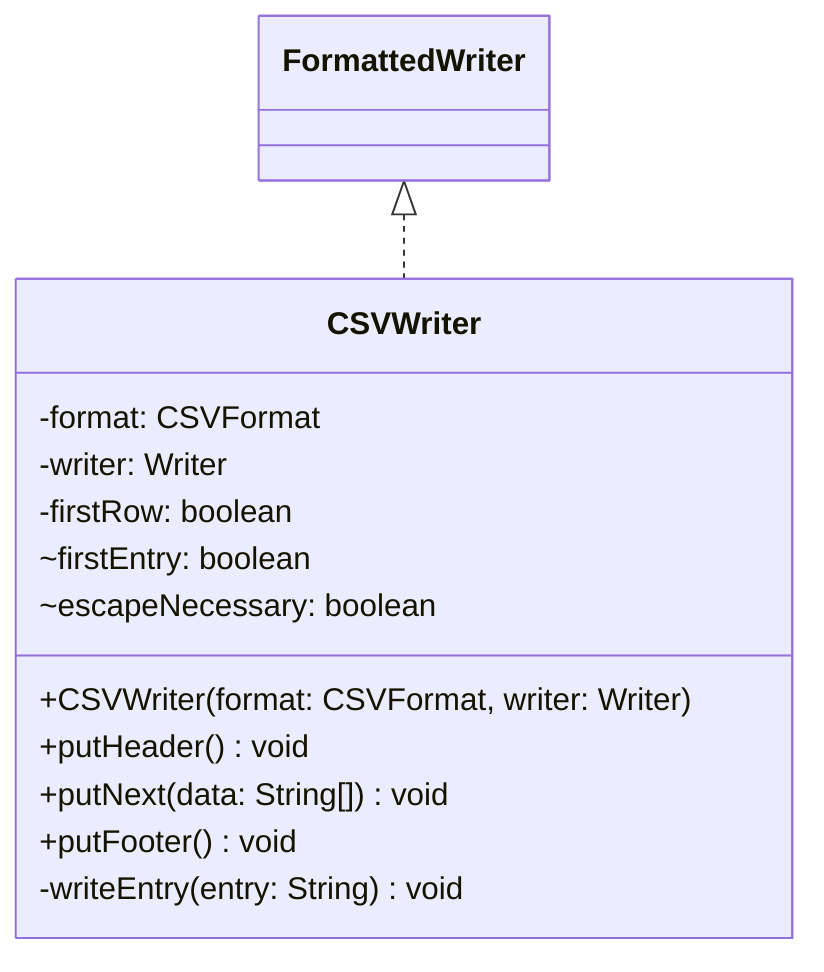

# CSVWriter.java

## Path
src/persistentdata/formatted/CSVWriter.java

## Explanation

This file defines the CSVWriter class in the persistentdata.formatted package. It belongs to src/persistentdata/formatted in the COMP2100 MiniLab codebase and handles formatted file input or output for persistent data. Key methods include putHeader, putNext, putFooter, writeEntry.

## Complexity

Reading is typically O(n) in the size of the input file.

## UML



## Code
```java
package persistentdata.formatted;

import persistentdata.PersistentDataException;

import java.io.IOException;
import java.io.Writer;

public class CSVWriter implements FormattedWriter<String[]> {
	private final CSVFormat format;
	private final Writer writer;

	public CSVWriter(CSVFormat format, Writer writer) {
		this.format = format;
		this.writer = writer;
	}

	private boolean firstRow = true;
	@Override
	public void putHeader() {
	}

	@Override
	public void putNext(String[] data) {
		if (data.length != format.COLUMN_COUNT) throw new PersistentDataException("Incorrect number of columns");
		try {
			if (firstRow) {
				firstRow = false;
			} else {
				writer.append(format.LINE_SEPARATOR);
			}
			boolean firstEntry = true;
			for (String entry : data) {
				if (firstEntry) {
					firstEntry = false;
				} else {
					writer.append(format.FIELD_SEPARATOR);
				}
				writeEntry(entry);
			}
		} catch (IOException e) {
			throw new PersistentDataException(e.getMessage());
		}
	}

	@Override
	public void putFooter() {
	}

	private void writeEntry(String entry) throws IOException {
		boolean escapeNecessary = false;
		for (int i = 0; i < entry.length(); i++) {
			char c = entry.charAt(i);
			if (c == format.ESCAPE_MARKER || c == format.LINE_SEPARATOR || c == format.FIELD_SEPARATOR) {
				escapeNecessary = true;
				break;
			}
		}
		if (escapeNecessary) {
			writer.append(format.ESCAPE_MARKER);
			for (int i = 0; i < entry.length(); i++) {
				char c = entry.charAt(i);
				if (c == format.ESCAPE_MARKER) {
					writer.append(c);
				}
				writer.append(c);
			}
			writer.append(format.ESCAPE_MARKER);
		} else {
			writer.append(entry);
		}
	}
}

```
