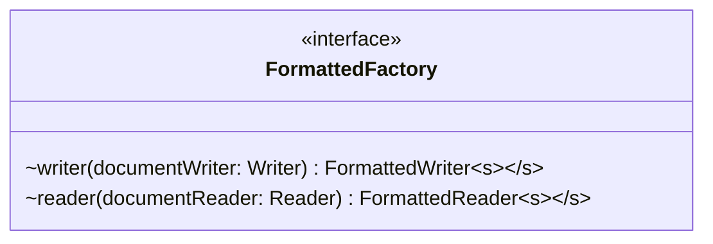

# FormattedFactory.java

## Path
src/persistentdata/formatted/FormattedFactory.java

## Explanation

This file defines the FormattedFactory interface in the persistentdata.formatted package. It belongs to src/persistentdata/formatted in the COMP2100 MiniLab codebase and defines a contract that other classes implement. Key methods include writer, reader.

## Complexity

Not specified.

## UML



## Code
```java
package persistentdata.formatted;

import java.io.Reader;
import java.io.Writer;

public interface FormattedFactory<S> {
	FormattedWriter<S> writer(Writer documentWriter);
	FormattedReader<S> reader(Reader documentReader);
}

```
