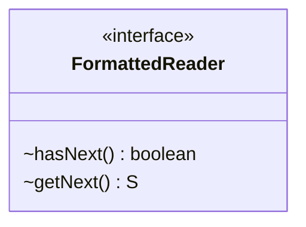

# FormattedReader.java

## Path
src/persistentdata/formatted/FormattedReader.java

## Explanation

This file defines the FormattedReader interface in the persistentdata.formatted package. It belongs to src/persistentdata/formatted in the COMP2100 MiniLab codebase and handles formatted file input or output for persistent data. Key methods include hasNext, getNext.

## Complexity

Reading is typically O(n) in the size of the input file.

## UML



## Code
```java
package persistentdata.formatted;

/**
 * Reads some data according to a particular format
 * @param <S> The serialised format to which the data should be parsed
 */
public interface FormattedReader<S> {
	/**
	 * Determines if the data has further serialised entries that have not yet been processed
	 * @return true if further entries exist, false otherwise
	 */
	boolean hasNext();

	/**
	 * Processes the next entry in the data.
	 * @return the serialised entry
	 * @exception persistentdata.PersistentDataException if the entry is malformed
	 * or otherwise illegally formatted, or if no further entries exist
	 */
	S getNext();
}

```
