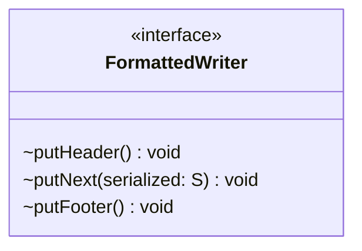

# FormattedWriter.java

## Path
src/persistentdata/formatted/FormattedWriter.java

## Explanation

This file defines the FormattedWriter interface in the persistentdata.formatted package. It belongs to src/persistentdata/formatted in the COMP2100 MiniLab codebase and handles formatted file input or output for persistent data. Key methods include putHeader, putNext, putFooter.

## Complexity

Writing is typically O(n) in the number of records or total output size.

## UML



## Code
```java
package persistentdata.formatted;

public interface FormattedWriter<S> {
	/**
	 * Writes the header at the start of the document, prior to any data.
	 */
	void putHeader();

	/**
	 * Formats and writes the next serialized entry.
	 * @param serialized the entry to write
	 */
	void putNext(S serialized);

	/**
	 * Writes the footer at the end of the document, after any data.
	 */
	void putFooter();
}

```
