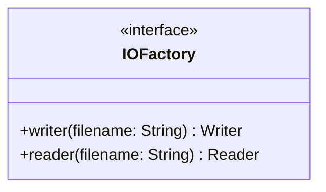

# IOFactory.java

## Path
src/persistentdata/io/IOFactory.java

## Explanation

This file defines the IOFactory interface in the persistentdata.io package. It belongs to src/persistentdata/io in the COMP2100 MiniLab codebase and defines a contract that other classes implement. Key methods include writer, reader.

## Complexity

Not specified.

## UML



## Code
```java
package persistentdata.io;

import java.io.Reader;
import java.io.Writer;

public interface IOFactory {
	public Writer writer(String filename);
	public Reader reader(String filename);
}

```
