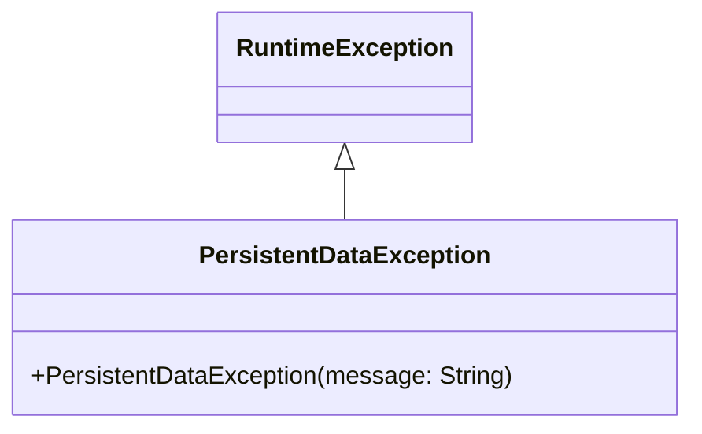

# PersistentDataException.java

## Path
src/persistentdata/PersistentDataException.java

## Explanation

This file defines the PersistentDataException class in the persistentdata package. It belongs to src/persistentdata in the COMP2100 MiniLab codebase and contains implementation logic for its codebase module.

## Complexity

Not specified.

## UML



## Code
```java
package persistentdata;

public class PersistentDataException extends RuntimeException {
	public PersistentDataException(String message) {
		super(message);
	}
}

```
