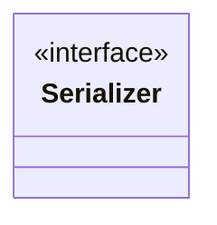

# Serializer.java

## Path
src/persistentdata/serialization/Serializer.java

## Explanation

This file defines the Serializer interface in the persistentdata.serialization package. It belongs to src/persistentdata/serialization in the COMP2100 MiniLab codebase and converts domain objects to and from persistent representations.

## Complexity

Not specified.

## UML



## Code
```java
package persistentdata.serialization;

@Deprecated
public interface Serializer<T, S> extends persistentdata.DataPipeline.Serializer<T, S> {
}

```
