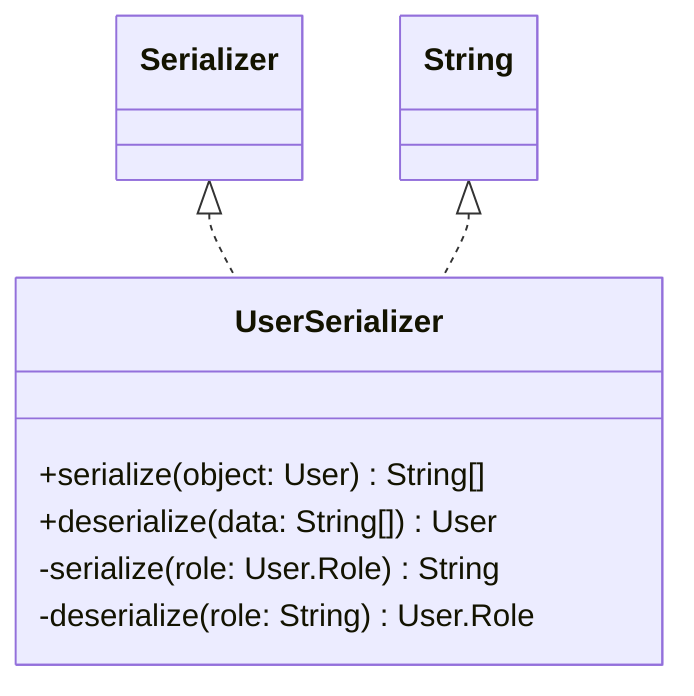

# UserSerializer.java

## Path
src/persistentdata/serialization/UserSerializer.java

## Explanation

This file defines the UserSerializer class in the persistentdata.serialization package. It belongs to src/persistentdata/serialization in the COMP2100 MiniLab codebase and converts domain objects to and from persistent representations. Key methods include serialize, deserialize.

## Complexity

Not specified.

## UML



## Code
```java
package persistentdata.serialization;

import dao.model.User;
import persistentdata.DataPipeline.Serializer;

import java.util.UUID;

/**
 * Stores users as UUID, role, username, and password fields.
 */
public class UserSerializer implements Serializer<User, String[]> {
	@Override
	public String[] serialize(User object) {
		return new String[] {object.id().toString(), serialize(object.role()), object.username(), object.password()};
	}

	@Override
	public User deserialize(String[] data) {
		return new User(UUID.fromString(data[0]), deserialize(data[1]), data[2], data[3]);
	}

	private static String serialize(User.Role role) {
		switch (role) {
			case Member:
				return "member";
			case Admin:
				return "admin";
			default:
				throw new IllegalArgumentException("Unknown user role");
		}
	}

	private static User.Role deserialize(String role) {
		switch (role) {
			case "member":
				return User.Role.Member;
			case "admin":
				return User.Role.Admin;
			default:
				throw new IllegalArgumentException("Unknown serialized user role");
		}
	}
}

```
