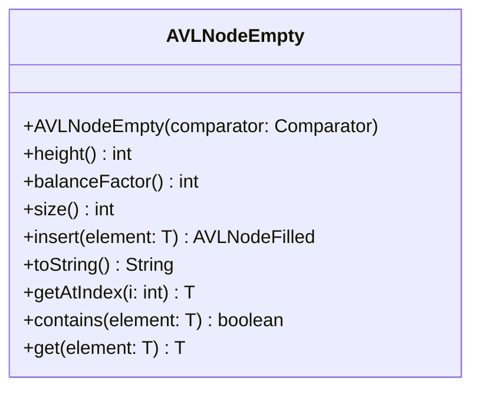

# AVLNodeEmpty.java

## Path
src/sorteddata/avltree/AVLNodeEmpty.java

## Explanation

This file defines the AVLNodeEmpty class in the sorteddata.avltree package. It belongs to src/sorteddata/avltree in the COMP2100 MiniLab codebase and implements AVL tree behavior for balanced sorted data operations. Key methods include height, balanceFactor, size, insert, toString.

## Complexity

Typical AVL tree operations such as search, insertion, and deletion are O(log n), assuming the tree remains height-balanced.

## UML



## Code
```java
package sorteddata.avltree;

import java.util.Comparator;

class AVLNodeEmpty<T> extends AVLNode<T> {
	public AVLNodeEmpty(Comparator<T> comparator) {
		super(comparator);
	}

	public int height() {
		return 0;
	}

	public int balanceFactor() {
		return 0;
	}

	public int size() {
		return 0;
	}

	public AVLNodeFilled<T> insert(T element) {
		return new AVLNodeFilled<>(comparator, element, this, this);
	}

	public String toString() {
		return ".";
	}

	public T getAtIndex(int i) {
		return null;
	}

	public boolean contains(T element) {
		return false;
	}

	public T get(T element) {
		return null;
	}
}

```
