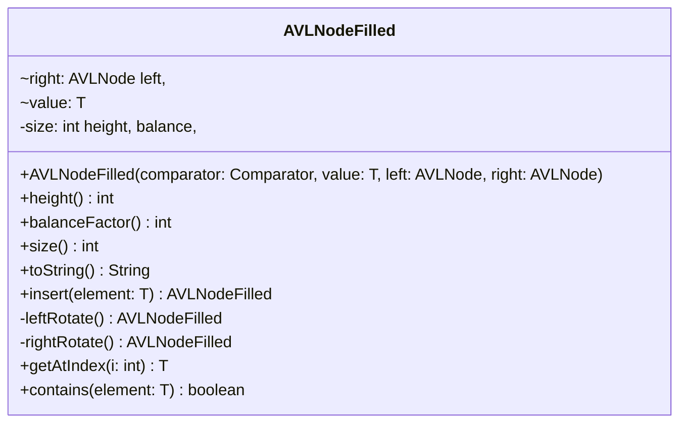

# AVLNodeFilled.java

## Path
src/sorteddata/avltree/AVLNodeFilled.java

## Explanation

This file defines the AVLNodeFilled class in the sorteddata.avltree package. It belongs to src/sorteddata/avltree in the COMP2100 MiniLab codebase and implements AVL tree behavior for balanced sorted data operations. Key methods include height, balanceFactor, size, toString, insert.

## Complexity

Typical AVL tree operations such as search, insertion, and deletion are O(log n), assuming the tree remains height-balanced.

## UML



## Code
```java
package sorteddata.avltree;

import java.util.Comparator;

class AVLNodeFilled<T> extends AVLNode<T> {
	final AVLNode<T> left, right;
	final T value;
	private final int height, balance, size;
	public AVLNodeFilled(Comparator<T> comparator, T value, AVLNode<T> left, AVLNode<T> right) {
		super(comparator);
		this.value = value;
		this.left = left;
		this.right = right;
		this.size = left.size() + right.size() + 1;
		this.height = Math.max(left.height(), right.height())+1;

		this.balance = left.height() - right.height();
	}

	public int height() {
		return height;
	}
	public int balanceFactor() {
		return balance;
	}
	public int size() {
		return size;
	}

	public String toString() {
		if (left instanceof AVLNodeEmpty<T> && right instanceof AVLNodeEmpty<T>)
			return value.toString();
		else
			return "%s -> (%s, %s)".formatted(value.toString(), left.toString(), right.toString());
	}

	public AVLNodeFilled<T> insert(T element) {
		if (comparator.compare(element, value) < 0) {
			AVLNodeFilled<T> subtree = left.insert(element);
			AVLNodeFilled<T> result = new AVLNodeFilled<>(comparator, value, subtree, right);

			if (result.balance < 2)
				return result;
			if (subtree.balance < 0)
				result = new AVLNodeFilled<>(comparator, value, subtree.leftRotate(), right);
			return result.rightRotate();
		} else if (comparator.compare(element, value) > 0) {
			AVLNodeFilled<T> subtree = right.insert(element);
			AVLNodeFilled<T> result = new AVLNodeFilled<>(comparator, value, left, subtree);

			if (result.balance > -2)
				return result;
			if (subtree.balance > 0)
				result = new AVLNodeFilled<>(comparator, value, left, subtree.rightRotate());
			return result.leftRotate();
		}
		return this;
	}

	/**
	 * Executes a left rotation on the current node, as defined
	 * by the AVL Tree algorithm.
	 * @return the new node taking this node's place after rotation
	 */
	private AVLNodeFilled<T> leftRotate() {
		AVLNodeFilled<T> rightFilled = (AVLNodeFilled<T>) right;
		AVLNodeFilled<T> newLeft = new AVLNodeFilled<>(comparator, value, left, rightFilled.left);
		return new AVLNodeFilled<>(comparator, rightFilled.value, newLeft, rightFilled.right);
	}

	/**
	 * Executes a right rotation on the current node, as defined
	 * by the AVL Tree algorithm.
	 * @return the new node taking this node's place after rotation
	 */
	private AVLNodeFilled<T> rightRotate() {
		AVLNodeFilled<T> leftFilled = (AVLNodeFilled<T>) left;
		AVLNodeFilled<T> newRight = new AVLNodeFilled<>(comparator, value, leftFilled.right, right);
		return new AVLNodeFilled<>(comparator, leftFilled.value, leftFilled.left, newRight);
	}

	public T getAtIndex(int i) {
		if (i < left.size()) return left.getAtIndex(i);
		else if (i == left.size()) return value;
		return right.getAtIndex(i - left.size() - 1);
	}

	public boolean contains(T element) {
		if (comparator.compare(value, element) < 0) {
			return right.contains(element);
		} else if (comparator.compare(element, value) < 0) {
			return left.contains(element);
		}
		return true;
	}

	public T get(T element) {
		if (comparator.compare(value, element) < 0) {
			return right.get(element);
		} else if (comparator.compare(element, value) < 0) {
			return left.get(element);
		}
		return value;
	}
}

```
