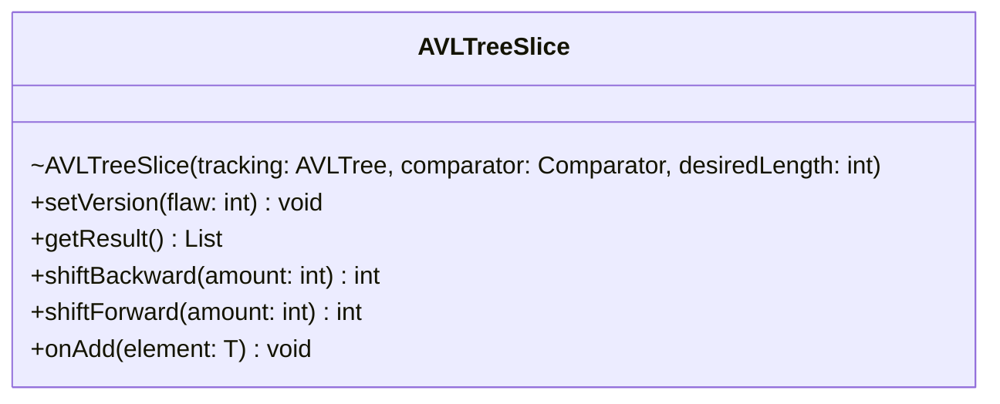

# AVLTreeSlice.java

## Path
src/sorteddata/avltree/AVLTreeSlice.java

## Explanation

This file defines the AVLTreeSlice class in the sorteddata.avltree package. It belongs to src/sorteddata/avltree in the COMP2100 MiniLab codebase and implements AVL tree behavior for balanced sorted data operations. Key methods include setVersion, getResult, shiftBackward, shiftForward, onAdd.

## Complexity

Typical AVL tree operations such as search, insertion, and deletion are O(log n), assuming the tree remains height-balanced.

## UML



## Code
```java
package sorteddata.avltree;
import sorteddata.SortedDataSlice;

import java.util.Comparator;
import java.util.List;

/**
 * In the black-box testing paradigm, you don't look at the code under consideration
 * while writing the tests. To enforce this, we've hidden the code for AVLTreeSlice
 * and it is only substituted when running the code on the CI. Refer to the definitions
 * in SortedDataSlice to understand how this class should function.
 */
public class AVLTreeSlice<T> implements SortedDataSlice<T> {
	AVLTreeSlice(AVLTree<T> tracking, Comparator<T> comparator, int desiredLength) { }

	public static void setVersion(int flaw) {

	}

	public List<T> getResult() { return null; }

	public int shiftBackward(int amount) { return 0; }

	public int shiftForward(int amount) { return 0; }

	public void onAdd(T element) {}
}
```
