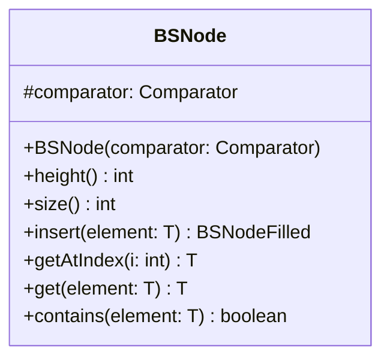

# BSNode.java

## Path
src/sorteddata/bstree/BSNode.java

## Explanation

This file defines the BSNode class in the sorteddata.bstree package. It belongs to src/sorteddata/bstree in the COMP2100 MiniLab codebase and implements binary search tree behavior for sorted data operations. Key methods include height, size, insert, getAtIndex, get.

## Complexity

Typical binary search tree operations are O(h), where h is tree height. In a balanced tree this is O(log n), but in the worst case it may be O(n).

## UML



## Code
```java
package sorteddata.bstree;

import java.util.Comparator;

abstract class BSNode<T> {
	protected final Comparator<T> comparator;
	public BSNode(Comparator<T> comparator) {
		this.comparator = comparator;
	}

	public abstract int height();

	public abstract int size();

	public abstract BSNodeFilled<T> insert(T element);

	public abstract T getAtIndex(int i);

	public abstract T get(T element);

	public abstract boolean contains(T element);
}
```
