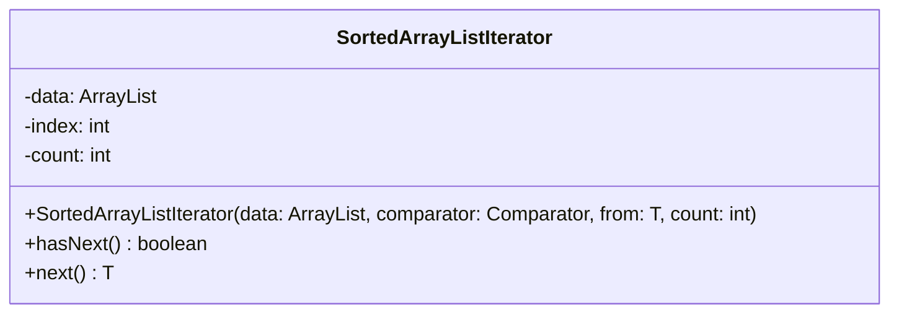

# SortedArrayListIterator.java

## Path
src/sorteddata/sortedarraylist/SortedArrayListIterator.java

## Explanation

This file defines the SortedArrayListIterator class in the sorteddata.sortedarraylist package. It belongs to src/sorteddata/sortedarraylist in the COMP2100 MiniLab codebase and implements sorted collection behavior backed by an array-list style structure. Key methods include hasNext, next.

## Complexity

Array-list access is O(1), while insertion and deletion may be O(n) because elements may need shifting. Search depends on implementation.

## UML



## Code
```java
package sorteddata.sortedarraylist;

import java.util.ArrayList;
import java.util.Comparator;
import java.util.Iterator;

public class SortedArrayListIterator<T> implements Iterator<T> {
	private final ArrayList<T> data;
	private int index;
	private int count;

	public SortedArrayListIterator(ArrayList<T> data, Comparator<T> comparator, T from, int count) {
		this.data = data;
		this.index = 0;
		if (from != null)
			while (index < data.size() && comparator.compare(from, data.get(index)) > 0) index++;
		this.count = count;
	}
	@Override
	public boolean hasNext() {
		return index < data.size() && count != 0;
	}

	@Override
	public T next() {
		count--;
		return data.get(index++);
	}
}

```
