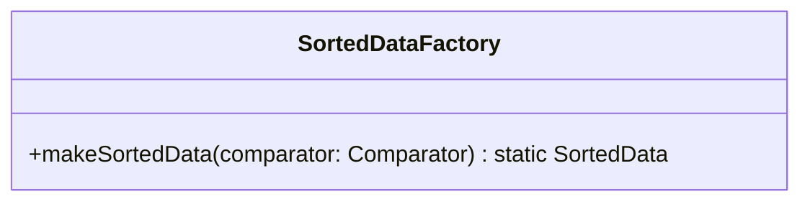

# SortedDataFactory.java

## Path
src/sorteddata/SortedDataFactory.java

## Explanation

This file defines the SortedDataFactory class in the sorteddata package. It belongs to src/sorteddata in the COMP2100 MiniLab codebase and contains implementation logic for its codebase module. Key methods include makeSortedData.

## Complexity

Not specified.

## UML



## Code
```java
package sorteddata;

import java.util.Comparator;

public class SortedDataFactory {
	public static <T> SortedData<T> makeSortedData(Comparator<T> comparator) {
		return new sorteddata.sortedarraylist.SortedArrayList<>(comparator);
		//return new sorteddata.avltree.AVLTree<>(comparator);
	}
}

```
