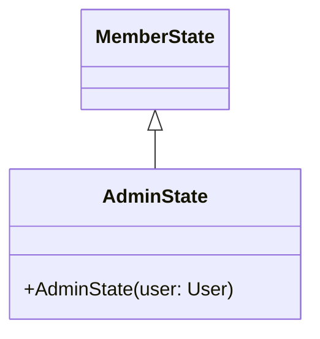

# AdminState.java

## Path
src/userstate/AdminState.java

## Explanation

This file defines the AdminState class in the userstate package. It belongs to src/userstate in the COMP2100 MiniLab codebase and models user state and state-transition behavior.

## Complexity

State transition operations are typically O(1) unless they trigger persistence or collection traversal.

## UML



## Code
```java
package userstate;

import dao.model.User;

public class AdminState extends MemberState {
	public AdminState(User user) {
		super(user);
	}
}

```
