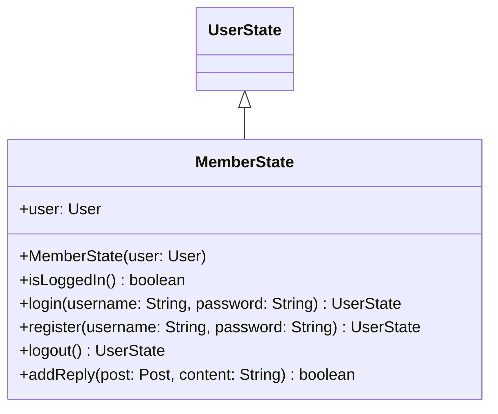

# MemberState.java

## Path
src/userstate/MemberState.java

## Explanation

This file defines the MemberState class in the userstate package. It belongs to src/userstate in the COMP2100 MiniLab codebase and models user state and state-transition behavior. Key methods include isLoggedIn, login, register, logout, addReply.

## Complexity

State transition operations are typically O(1) unless they trigger persistence or collection traversal.

## UML



## Code
```java
package userstate;

import dao.model.Message;
import dao.model.Post;
import dao.model.User;

import java.util.UUID;

public class MemberState extends UserState {
	public final User user;
	public MemberState(User user) {
		this.user = user;
	}

	@Override
	public boolean isLoggedIn() {
		return true;
	}

	@Override
	public UserState login(String username, String password) {
		return this;
	}

	@Override
	public UserState register(String username, String password) {
		return this;
	}

	@Override
	public UserState logout() {
		return new GuestState();
	}

	@Override
	public boolean addReply(Post post, String content) {
		post.messages.insert(new Message(UUID.randomUUID(), user.getUUID(), post.getUUID(), System.currentTimeMillis(), content));
		return true;
	}
}

```
