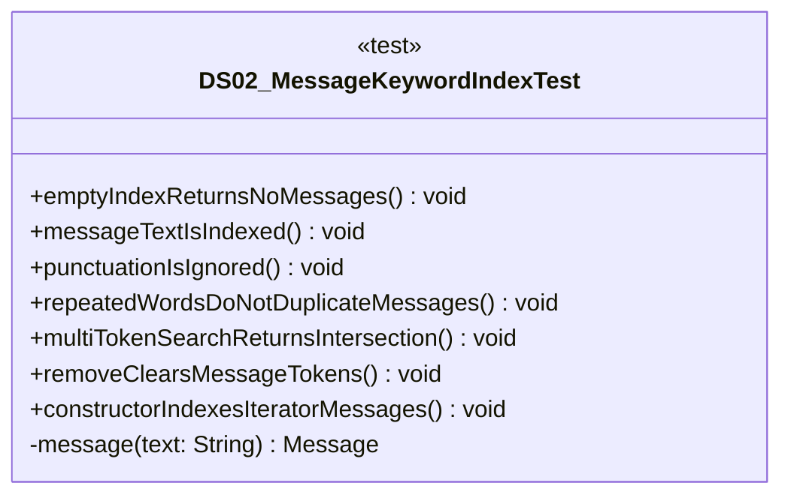

# DS02_MessageKeywordIndexTest.java

## Path
test/Mock_hackathon/DataStructures/DS02_MessageKeywordIndexTest.java

## Explanation

This test file defines the DS02_MessageKeywordIndexTest class in the hackathon package. It belongs to test/Mock_hackathon/DataStructures in the COMP2100 MiniLab codebase and verifies behavior of the ds02 message keyword index implementation. It uses JUnit 4 style testing through org.junit imports. Key methods include emptyIndexReturnsNoMessages, messageTextIsIndexed, punctuationIsIgnored, repeatedWordsDoNotDuplicateMessages, multiTokenSearchReturnsIntersection.

## Complexity

Test complexity depends on the tested scenario and input size; most unit tests use small fixed-size inputs.

## UML



## Code
```java
package hackathon;

import dao.model.Message;
import java.util.Arrays;
import java.util.Collections;
import java.util.UUID;
import org.junit.Test;
import static org.junit.Assert.*;

/**
 * Tests DS02: Message keyword inverted index.
 */
public class DS02_MessageKeywordIndexTest {
    // Verifies that an empty message index returns no messages.
    @Test
    public void emptyIndexReturnsNoMessages() {
        DS02_MessageKeywordIndex index = new DS02_MessageKeywordIndex();
        assertTrue(index.search("dao").isEmpty());
        assertEquals(0, index.size());
    }

    // Verifies that message text is indexed case-insensitively.
    @Test
    public void messageTextIsIndexed() {
        DS02_MessageKeywordIndex index = new DS02_MessageKeywordIndex();
        Message message = message("Review DAO methods");
        index.add(message);
        assertEquals(Collections.singletonList(message), index.search("dao"));
    }

    // Verifies that punctuation does not block search.
    @Test
    public void punctuationIsIgnored() {
        DS02_MessageKeywordIndex index = new DS02_MessageKeywordIndex();
        Message message = message("CSV, escaping works!");
        index.add(message);
        assertEquals(Collections.singletonList(message), index.search("escaping"));
    }

    // Verifies that repeated words do not duplicate messages.
    @Test
    public void repeatedWordsDoNotDuplicateMessages() {
        DS02_MessageKeywordIndex index = new DS02_MessageKeywordIndex();
        Message message = message("test test test");
        index.add(message);
        assertEquals(1, index.search("test").size());
        assertEquals(1, index.frequency("test"));
    }

    // Verifies that multi-token search returns intersections.
    @Test
    public void multiTokenSearchReturnsIntersection() {
        DS02_MessageKeywordIndex index = new DS02_MessageKeywordIndex();
        Message first = message("dao persistence review");
        Message second = message("dao graph review");
        index.add(first);
        index.add(second);
        assertEquals(Collections.singletonList(first), index.search("dao persistence"));
    }

    // Verifies that removing a message clears token buckets.
    @Test
    public void removeClearsMessageTokens() {
        DS02_MessageKeywordIndex index = new DS02_MessageKeywordIndex();
        Message message = message("delete this token");
        index.add(message);
        assertTrue(index.remove(message));
        assertTrue(index.search("token").isEmpty());
    }

    // Verifies that the iterator constructor loads messages.
    @Test
    public void constructorIndexesIteratorMessages() {
        Message first = message("alpha beta");
        Message second = message("beta gamma");
        DS02_MessageKeywordIndex index = new DS02_MessageKeywordIndex(Arrays.asList(first, second).iterator());
        assertEquals(2, index.frequency("beta"));
    }

    // Creates a MiniLab Message record for tests.
    private Message message(String text) {
        return new Message(UUID.randomUUID(), UUID.randomUUID(), UUID.randomUUID(), System.currentTimeMillis(), text);
    }
}

```
