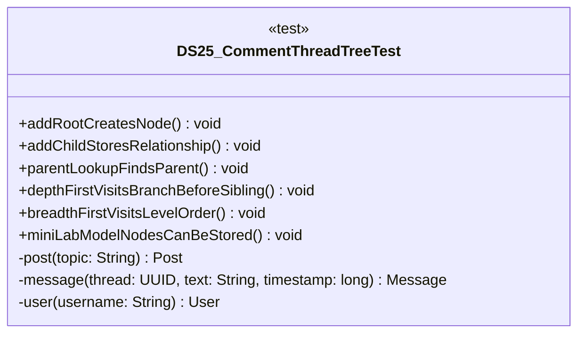

# DS25_CommentThreadTreeTest.java

## Path
test/Mock_hackathon/DataStructures/DS25_CommentThreadTreeTest.java

## Explanation

This test file defines the DS25_CommentThreadTreeTest class in the hackathon package. It belongs to test/Mock_hackathon/DataStructures in the COMP2100 MiniLab codebase and verifies behavior of the ds25 comment thread tree implementation. It uses JUnit 4 style testing through org.junit imports. Key methods include addRootCreatesNode, addChildStoresRelationship, parentLookupFindsParent, depthFirstVisitsBranchBeforeSibling, breadthFirstVisitsLevelOrder.

## Complexity

Test complexity depends on the tested scenario and input size; most unit tests use small fixed-size inputs.

## UML



## Code
```java
package hackathon;

import dao.model.Message;
import dao.model.Post;
import dao.model.User;
import java.util.Arrays;
import java.util.Collections;
import java.util.UUID;
import org.junit.Test;
import static org.junit.Assert.*;

/**
 * Tests DS25: Comment thread tree.
 */
public class DS25_CommentThreadTreeTest {
    // Verifies that adding a root creates one node.
    @Test
    public void addRootCreatesNode() {
        DS25_CommentThreadTree tree = new DS25_CommentThreadTree();
        UUID root = UUID.randomUUID();
        tree.addRoot(root);
        assertEquals(1, tree.nodeCount());
    }

    // Verifies direct children are recorded.
    @Test
    public void addChildStoresRelationship() {
        DS25_CommentThreadTree tree = new DS25_CommentThreadTree();
        UUID root = UUID.randomUUID();
        UUID child = UUID.randomUUID();
        tree.addChild(root, child);
        assertEquals(Collections.singletonList(child), tree.childrenOf(root));
    }

    // Verifies parent lookup after adding a child.
    @Test
    public void parentLookupFindsParent() {
        DS25_CommentThreadTree tree = new DS25_CommentThreadTree();
        UUID root = UUID.randomUUID();
        UUID child = UUID.randomUUID();
        tree.addChild(root, child);
        assertEquals(root, tree.parentOf(child).get());
    }

    // Verifies depth-first traversal order.
    @Test
    public void depthFirstVisitsBranchBeforeSibling() {
        DS25_CommentThreadTree tree = new DS25_CommentThreadTree();
        UUID root = UUID.randomUUID();
        UUID child = UUID.randomUUID();
        UUID grandchild = UUID.randomUUID();
        tree.addChild(root, child);
        tree.addChild(child, grandchild);
        assertEquals(Arrays.asList(root, child, grandchild), tree.depthFirst(root));
    }

    // Verifies breadth-first traversal order.
    @Test
    public void breadthFirstVisitsLevelOrder() {
        DS25_CommentThreadTree tree = new DS25_CommentThreadTree();
        UUID root = UUID.randomUUID();
        UUID left = UUID.randomUUID();
        UUID right = UUID.randomUUID();
        tree.addChild(root, left);
        tree.addChild(root, right);
        assertEquals(Arrays.asList(root, left, right), tree.breadthFirst(root));
    }
    // Verifies MiniLab posts messages and users can be represented as tree nodes.
    @Test
    public void miniLabModelNodesCanBeStored() {
        DS25_CommentThreadTree tree = new DS25_CommentThreadTree();
        Post post = post("root");
        Message message = message(post.id, "reply", 5L);
        User user = user("treeuser");
        tree.addPostRoot(post);
        tree.addMessageUnderThread(message);
        tree.addUserRoot(user);
        assertTrue(tree.childrenOf(post.id).contains(message.id()));
        assertEquals(3, tree.nodeCount());
    }

    // Creates a MiniLab Post for integration tests.
    private Post post(String topic) {
        return new Post(UUID.randomUUID(), UUID.randomUUID(), topic);
    }

    // Creates a MiniLab Message for integration tests.
    private Message message(UUID thread, String text, long timestamp) {
        return new Message(UUID.randomUUID(), UUID.randomUUID(), thread, timestamp, text);
    }

    // Creates a MiniLab User for integration tests.
    private User user(String username) {
        return new User(UUID.randomUUID(), User.Role.Member, username, "password");
    }


}

```
