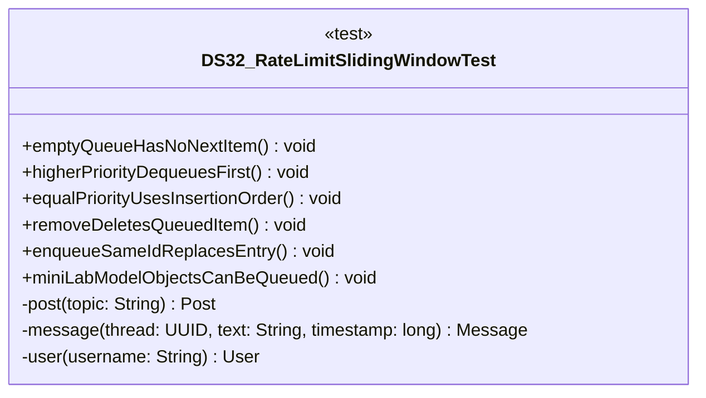

# DS32_RateLimitSlidingWindowTest.java

## Path
test/Mock_hackathon/DataStructures/DS32_RateLimitSlidingWindowTest.java

## Explanation

This test file defines the DS32_RateLimitSlidingWindowTest class in the hackathon package. It belongs to test/Mock_hackathon/DataStructures in the COMP2100 MiniLab codebase and verifies behavior of the ds32 rate limit sliding window implementation. It uses JUnit 4 style testing through org.junit imports. Key methods include emptyQueueHasNoNextItem, higherPriorityDequeuesFirst, equalPriorityUsesInsertionOrder, removeDeletesQueuedItem, enqueueSameIdReplacesEntry.

## Complexity

Test complexity depends on the tested scenario and input size; most unit tests use small fixed-size inputs.

## UML



## Code
```java
package hackathon;

import dao.model.Message;
import dao.model.Post;
import dao.model.User;
import java.util.UUID;
import org.junit.Test;
import static org.junit.Assert.*;

/**
 * Tests DS32: Rate-limit sliding window.
 */
public class DS32_RateLimitSlidingWindowTest {
    // Verifies that a new queue is empty.
    @Test
    public void emptyQueueHasNoNextItem() {
        DS32_RateLimitSlidingWindow queue = new DS32_RateLimitSlidingWindow();
        assertFalse(queue.peek().isPresent());
        assertEquals(0, queue.size());
    }

    // Verifies that higher priority items are returned first.
    @Test
    public void higherPriorityDequeuesFirst() {
        DS32_RateLimitSlidingWindow queue = new DS32_RateLimitSlidingWindow();
        UUID low = UUID.randomUUID();
        UUID high = UUID.randomUUID();
        queue.enqueue(low, "low", 1);
        queue.enqueue(high, "high", 10);
        assertEquals(high, queue.dequeue().get().getId());
    }

    // Verifies FIFO behavior for equal priorities.
    @Test
    public void equalPriorityUsesInsertionOrder() {
        DS32_RateLimitSlidingWindow queue = new DS32_RateLimitSlidingWindow();
        UUID first = UUID.randomUUID();
        UUID second = UUID.randomUUID();
        queue.enqueue(first, "first", 5);
        queue.enqueue(second, "second", 5);
        assertEquals(first, queue.dequeue().get().getId());
    }

    // Verifies that removing an item prevents dequeue.
    @Test
    public void removeDeletesQueuedItem() {
        DS32_RateLimitSlidingWindow queue = new DS32_RateLimitSlidingWindow();
        UUID id = UUID.randomUUID();
        queue.enqueue(id, "item", 3);
        assertTrue(queue.remove(id));
        assertFalse(queue.contains(id));
    }

    // Verifies that replacing an item keeps one entry.
    @Test
    public void enqueueSameIdReplacesEntry() {
        DS32_RateLimitSlidingWindow queue = new DS32_RateLimitSlidingWindow();
        UUID id = UUID.randomUUID();
        queue.enqueue(id, "old", 1);
        queue.enqueue(id, "new", 9);
        assertEquals(1, queue.size());
        assertEquals("new", queue.peek().get().getText());
    }
    // Verifies MiniLab model objects can be queued directly.
    @Test
    public void miniLabModelObjectsCanBeQueued() {
        DS32_RateLimitSlidingWindow queue = new DS32_RateLimitSlidingWindow();
        Post post = post("queued post");
        Message message = message(post.id, "queued message", 5L);
        User user = user("queueduser");
        queue.enqueuePost(post, 3);
        queue.enqueueMessage(message, 5);
        queue.enqueueUser(user, 1);
        assertEquals(3, queue.size());
        assertEquals(message.id(), queue.dequeue().get().getId());
    }

    // Creates a MiniLab Post for integration tests.
    private Post post(String topic) {
        return new Post(UUID.randomUUID(), UUID.randomUUID(), topic);
    }

    // Creates a MiniLab Message for integration tests.
    private Message message(UUID thread, String text, long timestamp) {
        return new Message(UUID.randomUUID(), UUID.randomUUID(), thread, timestamp, text);
    }

    // Creates a MiniLab User for integration tests.
    private User user(String username) {
        return new User(UUID.randomUUID(), User.Role.Member, username, "password");
    }


}

```
